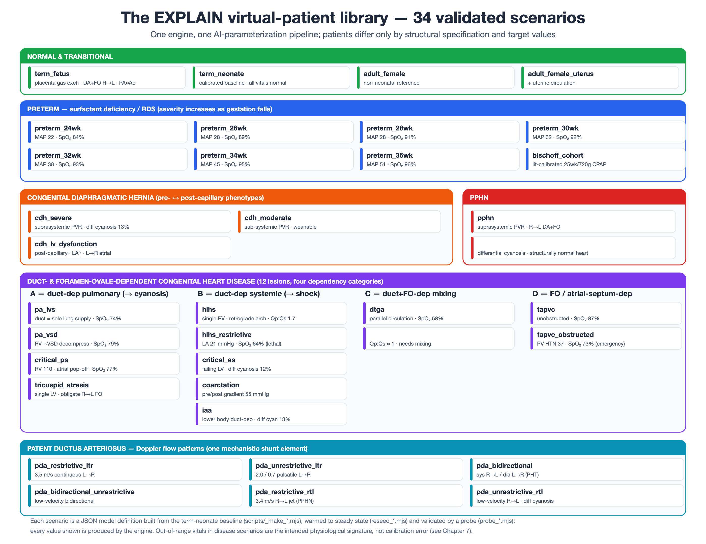

# Chapter 7 — A Library of Validated Neonatal Virtual Patients

*Consolidated validation chapter of the compilation thesis. Where Chapters 2–5 develop the physics of
each subsystem and Chapter 6 the method by which an individual patient is parameterized, this chapter
demonstrates that the integrated model, once parameterized, reproduces the physiology of the range of
patients it is intended to represent — from the normal term fetus and neonate, through the preterm
series with surfactant deficiency, to congenital diaphragmatic hernia, persistent pulmonary
hypertension, and the family of duct- and foramen-ovale-dependent congenital heart disease. Every
simulated value in this chapter is produced by the engine and reproduced by a named probe script, not
asserted (the reproducibility convention of the series; Chapter 2 §2.3). Citation numbering is local
to this chapter and will be merged into the consolidated bibliography at assembly; entries marked
**[VERIFY]** are to be confirmed against PubMed before submission.*

---

## 7.0 Validation approach

The virtual-patient library comprises 34 scenarios (`public/model_definitions/index.json`), each a JSON
model definition built from the calibrated term-neonate baseline by a documented structural
transformation (`scripts/_make_*.mjs`), warmed to its steady-state operating point
(`scripts/reseed_*.mjs`), and measured by a headless probe (`scripts/probe_*.mjs`). Two references
anchor the validation:

1. **Normal-range tables.** `scripts/_probe.mjs` defines resting normal ranges for every reported vital
   and blood-gas quantity, in ten body-size/gestation profiles (`adult`, `neonate`, and
   `preterm_24…36`). The probe flags each measured value LOW / ok / HIGH against the appropriate
   profile. For the *normal* patients (term neonate; each preterm at its own gestational profile) an
   all-"ok" panel *is* the validation. For the *disease* patients the point is the opposite: the model
   must reproduce the disease's signature, so out-of-range flags (a suprasystemic pulmonary pressure, a
   low oxygen saturation) are the intended, correct result — the validation is that the *pattern and
   magnitude* match the literature, not that the numbers fall in the normal band.

2. **Per-patient literature targets.** Each `_make_*.mjs` header records the quantitative targets and
   the primary literature the phenotype was built to reproduce; the congenital-heart-disease family is
   additionally anchored to the clinical monograph `docs/engine/chd_duct_fo_dependent.md` (four-category
   taxonomy, ~14-lesion catalogue, 46 PubMed-verified references).

Because every patient in the library is instantiated by the AI-assisted parameterization pipeline of
Chapter 6 — an interpretation layer that sets the structural specification and a deterministic
one-lever-per-target calibrator that fits the measured targets — each section below notes briefly *how
the patient was parameterized* (the structural levers and the calibration targets), tying the
validation back to the method. All values are steady-state, cycle-averaged over a measurement window
after warm-up, with the autonomic control loops active.

---

**Figure 7.1.** The EXPLAIN virtual-patient library — 34 validated scenarios, grouped by family: normal
and transitional (fetus, term neonate, adult reference); the preterm surfactant-deficiency/RDS series;
congenital diaphragmatic hernia (pre- ↔ post-capillary phenotypes); persistent pulmonary hypertension;
the duct- and foramen-ovale-dependent congenital-heart-disease lesions in their four dependency
categories (A duct-dependent pulmonary, B duct-dependent systemic, C duct+FO-dependent mixing, D
FO/atrial-septum-dependent); and the patent-ductus-arteriosus Doppler patterns. Each chip shows the
scenario's defining signature; every value is produced by the engine, and out-of-range vitals in
disease scenarios are the intended physiological signature, not calibration error. All patients are
built from the term-neonate baseline and instantiated through the same parameterization pipeline
(Chapter 6). (Editable master: `thesis_fig_patient_library.svg`.)

## 7.1 Normal term fetus

**Scenario `term_fetus`; probes `probe_fetus.mjs`, `probe_vitals.mjs`.** The fetal circulation is the
model's most stringent structural test because it is topologically different from the neonate: the
placenta, not the lung, is the gas-exchange organ; the ductus arteriosus and foramen ovale are widely
open and carry the dominant flows; pulmonary vascular resistance is high and the fluid-filled lungs are
nearly excluded from the circulation. *Parameterization (Chapter 6):* structurally, the placenta is
enabled as a gas exchanger equilibrating fetal capillary blood to a fixed maternal pool, the ductus is
set wide open, the foramen ovale is opened, the intrapulmonary shunts are closed, and pulmonary vascular
resistance is raised ~21-fold; calibration then targets fetal combined output, the DA/FO/placental flow
partition, and the umbilical-artery blood gas.

| Quantity | Simulated (`term_fetus`) | Expected (fetal physiology) |
|---|---|---|
| Heart rate | 149 /min | ~140–150 /min |
| Aortic pressure (AA) sys/dia/mean | 59 / 41 / 50 mmHg | mean ~45–50 mmHg |
| Pulmonary artery pressure mean | 63 mmHg (PA ≥ Ao) | PA ≈ or > systemic (high PVR) |
| Combined ventricular output (CVO) | 1.12 L/min = 315 mL/kg/min | ~400–450 mL/kg/min [1,2] |
| RV : LV output split | 48 : 52 | RV-dominant (~55–60 : 45–40) [1] |
| Ductus arteriosus flow (PA→Ao) | −436 mL/min = 39 % of CVO, R→L | ~30–46 % of CVO, R→L [1,2] |
| Foramen ovale flow | −482 mL/min = 43 % of CVO, R→L | obligate R→L, ~30–40 % [1] |
| Umbilical / placental flow | ~45 % of CVO | ~40–45 % of CVO [2] |
| Pulmonary flow (PA→lungs) | 99 mL/min = 9 % of CVO | ~10–13 % of CVO (term) [1] |
| Oxygenation gradient | UV 88 % > IVC 71 % > AA 66 % > AD 61 % | UV > IVC > AA (pre-ductal) > AD (post-ductal) [1] |
| Umbilical-artery gas | pH 7.27, PCO₂ 50, PO₂ 27, BE −5 | pH ~7.25–7.30, PCO₂ ~45–55, BE ~−3 to −6 [2] |

The model reproduces the qualitative and near-quantitative signature of the fetal circulation: a
parallel circulation with PA ≈ aortic pressure, right-to-left ductal and foramen-ovale flow that
together carry ~80 % of combined output away from the lungs, placental flow at ~45 % of output, and the
characteristic streaming gradient in which the umbilical vein is the best-oxygenated blood and the
pre-ductal ascending aorta is better oxygenated than the post-ductal descending aorta. Combined output
(315 mL/kg/min) sits modestly below the classic reference (~400–450 mL/kg/min) [1] and the RV:LV split
is closer to unity than the RV-dominant fetal ratio — both are noted as calibration targets for future
refinement — but the flow *partition* and the *oxygen cascade* are reproduced faithfully. (Against the
neonatal normal-range table `probe_vitals` flags the low SpO₂, high PAP and low PO₂ as out of range;
these are the correct fetal values, and the fetal-specific comparison above is the appropriate one.)

## 7.2 Normal term neonate

**Scenario `term_neonate`; probe `probe_vitals.mjs --profile neonate`.** This is the calibrated baseline
from which every other neonatal and disease scenario is derived, and its validation is that the full
resting panel falls within the neonatal normal ranges [3–6].

| Quantity | Simulated | Neonatal normal range | Flag |
|---|---|---|---|
| Heart rate | 131 /min | 100–160 | ok |
| ABP systolic / diastolic | 72 / 47 mmHg | 55–90 / 30–55 | ok |
| ABP mean | 59 mmHg | 40–60 | ok |
| Central venous pressure | 3.1 mmHg | 2–8 | ok |
| PAP systolic / mean | 40 / 27 mmHg | 18–40 / 12–30 | ok |
| LV output (cardiac output) | 0.69 L/min | ~0.5–0.8 (≈195 mL/kg/min) | ok |
| SpO₂ pre-ductal | 97 % | 93–100 | ok |
| SvO₂ | 79 % | 60–80 | ok |
| Respiratory rate | 41 /min | 30–60 | ok |
| etCO₂ | 36 mmHg | 35–45 | ok |
| pH | 7.36 | 7.30–7.42 | ok |
| PaCO₂ | 40 mmHg | 35–45 | ok |
| PaO₂ | 75 mmHg | 50–85 | ok |
| HCO₃⁻ / Base excess | 22 mmol/L / −3.0 | 18–24 / −6…+2 | ok |

Every reported vital and blood-gas quantity lies within the resting neonatal range, with the ~1:1 LVO:RVO
balance, closed shunts (pre-/post-ductal SpO₂ 97/97 %), and a normal acid–base state expected of a
healthy term newborn. This all-"ok" panel is the reference against which the disease deviations below
are read.

## 7.3 Preterm series with surfactant deficiency (respiratory distress syndrome)

**Scenarios `preterm_24wk … preterm_36wk`; probe `probe_vitals.mjs --profile preterm_NN`.** The seven
preterm patients span 24–36 weeks. *Parameterization (Chapter 6):* prematurity is modelled by
allometric size scaling to the gestational body weight plus a gestation-graded RDS lung phenotype
(surfactant deficiency → stiffer alveoli, lower functional residual capacity, reduced
alveolar–capillary diffusion, intrapulmonary shunt), with the baroreflex set-point lowered to the
preterm's normal mean arterial pressure (≈ gestational age in mmHg [7,8]) and mild cardiac immaturity
and a left-to-right PDA graded by gestation. Each patient is validated against its own gestational
normal-range profile.

| GA (wk) | Weight (kg) | HR (/min) | MAP (mmHg) | SpO₂ (%) | PaO₂ (mmHg) | pH | PaCO₂ (mmHg) | All flags |
|---|---|---|---|---|---|---|---|---|
| 24 | 0.64 | 150 | 22 | 84 | 47 | 7.22 | 56 | ok |
| 26 | 0.85 | 170 | 28 | 89 | 52 | 7.26 | 51 | ok |
| 28 | 1.0 | 178 | 28 | 91 | 55 | 7.28 | 49 | ok |
| 30 | 1.35 | 159 | 32 | 92 | 57 | 7.30 | 46 | ok |
| 32 | 1.7 | 151 | 38 | 93 | 59 | 7.32 | 44 | ok |
| 34 | 2.2 | 144 | 45 | 95 | 66 | 7.34 | 42 | ok |
| 36 | 2.7 | 137 | 51 | 96 | 69 | 7.35 | 41 | ok |

The series reproduces the expected monotone gestational trends: mean arterial pressure rises with
gestation (≈ GA in mmHg, from 22 mmHg at 24 weeks to 51 mmHg at 36 weeks [7,8]), oxygenation improves as
RDS severity falls (SpO₂ 84 → 96 %, PaO₂ 47 → 69 mmHg), and the mild respiratory acidosis of surfactant
deficiency resolves toward term (PaCO₂ 56 → 41 mmHg, pH 7.22 → 7.35). All values fall within the
gestation-specific normal ranges. A separate literature-calibrated preterm patient, `bischoff_cohort`,
reproduces the Bischoff *et al.* 2021 cohort (n = 45, ~25.5 wk, 720 g, spontaneously breathing on CPAP)
to its published targets — HR 159 /min, LVO 187 / RVO 151 mL/kg/min (a net left-to-right ductal steal),
pH 7.34, PaCO₂ 44 mmHg, BE −1.2, PDA ~1.3 mm [9] — and is the clearest single example of direct
calibration to a published dataset.

## 7.4 Congenital diaphragmatic hernia

**Scenarios `cdh_severe`, `cdh_moderate`, `cdh_lv_dysfunction`; probes `probe_vitals.mjs`,
`probe_cdh.mjs`.** Modern literature stresses that CDH-associated pulmonary hypertension is not one
physiology but splits into hemodynamic phenotypes that demand different management [10–13]. *Parameter­
ization (Chapter 6):* all three are term neonates, intubated and ventilated, built on a shared lever set
— asymmetric pulmonary hypoplasia (left worse), raised pulmonary vascular resistance, open shunts, and
graded left-ventricular involvement — differing in which lever dominates.

| Quantity | `cdh_severe` | `cdh_moderate` | `cdh_lv_dysfunction` |
|---|---|---|---|
| Phenotype | pre-capillary (PVR-dominant) | sub-systemic PVR (weanable) | post-capillary (LV-dominant) |
| MAP (mmHg) | 50 | 53 | 47 |
| PAP mean (mmHg) | 55 (**≥ MAP**) | 48 (< MAP) | 53 (**≥ MAP**) |
| LV output (L/min) | 0.34 | 0.64 | 0.25 |
| Ductal shunt | −196 mL/min R→L | +63 mL/min L→R | −217 mL/min R→L |
| Atrial (FO) shunt | +163 mL/min L→R | +53 mL/min L→R | +358 mL/min L→R |
| LA pressure (mmHg) | 4.4 | 4.7 | **6.3** |
| LV end-diastolic (mmHg) | 1.7 | 0.9 | **3.7** |
| SpO₂ pre / post (%) | 76 / 63 (**diff 13**) | 92 / 92 (diff 0) | 85 / 72 (**diff 13**) |
| PaO₂ / PaCO₂ (mmHg) | 38 / 54 | 55 / 44 | 43 / 45 |

The three phenotypes are cleanly separated in exactly the dimensions the literature uses to distinguish
them. `cdh_severe` shows suprasystemic pulmonary pressure with a dominant right-to-left ductal shunt and
marked differential cyanosis (pre/post SpO₂ 76/63 %) — the classic severe pre-capillary picture.
`cdh_moderate` sits with sub-systemic PVR, a small left-to-right duct and near-normal oxygenation — the
weanable contrast case. `cdh_lv_dysfunction` is distinguished not by the pulmonary bed but by the left
heart: the highest LA pressure (6.3 mmHg) and LV end-diastolic pressure (3.7 mmHg) and a large
left-to-right atrial shunt (the post-capillary marker), with a right-to-left ductus offloading the right
ventricle — the phenotype in which pulmonary vasodilators may worsen pulmonary oedema [11]. Reproducing
this LA-pressure/atrial-shunt distinction is the specific validation that the model captures the
pre- versus post-capillary split rather than a single "CDH-PH" state.

## 7.5 Persistent pulmonary hypertension of the newborn

**Scenario `pphn`; probes `probe_vitals.mjs`, `probe_cdh.mjs`.** PPHN is the failure of the normal
postnatal fall in pulmonary vascular resistance, producing suprasystemic PVR with extrapulmonary
right-to-left shunting and hypoxemia in a structurally normal heart [14–17]. *Parameterization (Chapter
6):* the `pphn` patient is idiopathic/vascular PPHN — a term neonate with structurally normal heart and
near-normal lung mechanics (distinguishing it from CDH, which adds hypoplasia and LV disease, and from a
simple PDA), given symmetric (diffuse) suprasystemic pulmonary vascular resistance with right-to-left
ductal and atrial shunting, ventilated at FiO₂ 1.0.

| Quantity | Simulated (`pphn`) | Expected (severe PPHN) |
|---|---|---|
| MAP / PAP mean (mmHg) | 55 / 56 (**PAP ≥ MAP, suprasystemic**) | PAP ≥ systemic [14,15] |
| Ductal shunt | −64 mL/min **R→L** | R→L or bidirectional at duct [16] |
| Atrial (FO) shunt | −80 mL/min **R→L** | R→L or bidirectional at FO [16] |
| LA / LV end-diastolic (mmHg) | 5.1 / 2.0 (**normal — structurally normal heart**) | normal (no left-heart lesion) [16] |
| SpO₂ pre / post (%) | 86 / 81 (**differential cyanosis**) | pre > post, differential [14,16] |
| PaO₂ on FiO₂ 1.0 (mmHg) | 41 (**LOW**) | labile hypoxemia despite high FiO₂ [14] |
| pH / PaCO₂ (mmHg) | 7.36 / 41 | near-normal or mild acidosis |

The scenario reproduces the echocardiographic diagnostic criteria for PPHN [16]: suprasystemic
pulmonary pressure, right-to-left shunting at *both* the ductus and the foramen ovale, and the absence of
structural heart disease (normal LA and LV filling pressures), together with the clinical hallmarks of
differential cyanosis (pre-ductal 86 % > post-ductal 81 %) and hypoxemia resistant to a high inspired
oxygen fraction (PaO₂ 41 mmHg on FiO₂ 1.0). It is deliberately distinct from `cdh_severe` (which shares
the suprasystemic-PVR/R→L-shunt physiology but adds lung hypoplasia and a wider differential) and from
the R→L PDA Doppler patterns of §7.7 (which shape a single ductal waveform), giving the library a
dedicated, structurally clean PPHN patient.

## 7.6 Duct- and foramen-ovale-dependent congenital heart disease

**Scenarios (12): `dtga`, `hlhs`, `hlhs_restrictive`, `critical_ps`, `pa_ivs`, `pa_vsd`,
`tricuspid_atresia`, `critical_as`, `iaa`, `coarctation`, `tapvc`, `tapvc_obstructed`; probes
`probe_vitals.mjs`, `probe_cdh.mjs`, and per-lesion `probe_*.mjs`.** These are the lesions that dominate
the NICU because they depend on the ductus arteriosus and/or the foramen ovale for survival: the neonate
is stable while the channel is patent and collapses — with cyanosis or shock — as it closes. The unifying
concept is the **balanced parallel circulation**, in which the systemic and pulmonary circuits run in
parallel and share output across the patent channel, so stability is set by the pulmonary-to-systemic
flow ratio (Qp:Qs) and the PVR/SVR balance [18,19]. The family is organized into four dependency
categories [18]. *Parameterization (Chapter 6):* each lesion is a term neonate built from the baseline by
JSON-level structural levers (valve atresia/stenosis via `no_flow`/`r_for`, shunt geometries via the
`Pda`/`Shunts` models, chamber hypoplasia via `Heart` factors, arch obstruction and anomalous venous
drainage via re-pointed resistors), documented lesion-by-lesion in `docs/engine/chd_duct_fo_dependent.md`.

### Category A — duct-dependent pulmonary blood flow (closure → cyanosis)

| Lesion | Ductal shunt | Atrial (FO) shunt | SpO₂ (%) | PAP vs MAP | Key marker |
|---|---|---|---|---|---|
| `pa_ivs` (PA + intact septum) | +592 mL/min L→R (duct = sole lung supply) | −503 R→L (obligate) | 74 | < MAP | blind hypertensive RV; duct- **and** FO-dependent |
| `pa_vsd` (PA + VSD) | +750 mL/min L→R (sole lung supply) | ~0 (septum intact) | 79 | < MAP | RV decompresses via VSD (RV/LV pressures equilibrated) |
| `critical_ps` | +310 mL/min L→R (majority of lung flow) | −339 R→L pop-off | 77 | < MAP | suprasystemic pressure-loaded RV; atrial pop-off |
| `tricuspid_atresia` | +298 mL/min L→R | −491 R→L (obligate) | 80 | < MAP | single-LV; lung flow via VSD→RV→PA + duct |

In every Category-A lesion the right-heart outflow to the lungs is obstructed or absent, so pulmonary
blood flow arrives backwards through the duct (aorta → PDA → PA, i.e. left-to-right ductal flow), and
the model shows exactly this: a large left-to-right ductal shunt supplying the lungs, cyanosis
(SpO₂ 74–80 %), and sub-systemic pulmonary pressure. The two also-FO-dependent lesions (`pa_ivs`,
`tricuspid_atresia`) additionally show the obligate right-to-left atrial shunt (≈ 490–500 mL/min ≈ the
whole systemic venous return) that must cross the septum to fill the left heart. Duct-closure tests
(probe with the duct shut) crash oxygenation, confirming duct-dependence [per-lesion probes].

### Category B — duct-dependent systemic blood flow (closure → shock)

| Lesion | Ductal shunt | Atrial (FO) shunt | SpO₂ pre/post (%) | MAP / PAP | Key marker |
|---|---|---|---|---|---|
| `hlhs` | −455 mL/min R→L (systemic supply) | +751 L→R (obligate) | 78 / 78 | 46 / 54 (PAP ≥ MAP) | single RV; retrograde arch/coronary perfusion |
| `hlhs_restrictive` | −384 mL/min R→L | +416 L→R (choked) | 64 / 64 | 41 / 46 | **LA pressure 21 mmHg** (pulm venous HTN) — lethal |
| `critical_as` | −127 mL/min R→L (~40 % systemic) | +689 L→R | 96 / 85 (**diff 12**) | 39 / 44 | pressure-loaded failing LV; differential cyanosis |
| `coarctation` | −15 mL/min R→L | ~0 | 97 / 87 (**diff 10**) | 78 / 24 | pre/post-ductal gradient (upper-body hypertension) |
| `iaa` | −207 mL/min R→L (lower body) | ~0 | 97 / 84 (**diff 13**) | 57 / 42 | lower body entirely duct-dependent; VSD |

In Category B the left-heart outflow to the body is obstructed, so systemic perfusion arrives
right-to-left through the duct (PA → PDA → descending aorta), and the model reproduces the two hallmark
patterns. In the single-ventricle lesions (`hlhs`) the right ventricle is the systemic pump, giving
suprasystemic pulmonary pressure, an obligate left-to-right atrial shunt, and retrograde aortic-arch and
coronary perfusion; the restrictive-septum variant reproduces the lethal emergency — the atrial
communication cannot decompress the left atrium, so LA pressure rises to 21 mmHg (a ~19 mmHg
trans-septal gradient = severe pulmonary venous hypertension) and hypoxemia deepens to SpO₂ 64 % [18].
In the outflow-obstruction lesions (`critical_as`, `coarctation`, `iaa`) the model produces the
diagnostic **differential cyanosis** (pre-ductal 96–97 % from the LV-fed upper body versus post-ductal
84–87 % from the duct-fed lower body; differential 10–13 %) and, in coarctation, the pre/post-ductal
pressure gradient (upper body 78 mmHg mean versus a duct-dependent lower body).

### Category C — duct- and FO-dependent mixing

| Lesion | Ductal shunt | Atrial (FO) shunt | SpO₂ (%) | Qp:Qs | Key marker |
|---|---|---|---|---|---|
| `dtga` (d-TGA, intact septum) | +305 mL/min L→R | +304 mL/min L→R | 58 | ≈ 1 | parallel circulations; cyanosis inversely ∝ mixing |

In d-transposition the aorta arises from the right ventricle and the pulmonary artery from the left, so
the two circulations run in parallel and survival depends entirely on mixing. The model (with the
pre-wired outflow tracts swapped) settles to a stable parallel circulation with balanced ~0.8 L/min
outputs and profound cyanosis (SpO₂ 58 %); mixing across the foramen ovale and duct is what oxygenates
the systemic circuit, and a balloon atrial septostomy is demonstrable by ramping the foramen-ovale
diameter [19,20].

### Category D — foramen-ovale / atrial-septum-dependent

| Lesion | Ductal shunt | Atrial (FO) shunt | PV pressure | SpO₂ (%) | MAP / PAP | Key marker |
|---|---|---|---|---|---|---|
| `tapvc` (unobstructed) | 0 (not duct-dependent) | −592 mL/min R→L (fills left heart) | ~10 mmHg | 87 | 53 / 32 | complete mixing; mild cyanosis; PGE1-unresponsive |
| `tapvc_obstructed` | 0 | −431 mL/min R→L | ~37 mmHg | 73 | 44 / 51 (PAP ≥ MAP) | pulmonary venous hypertension; surgical emergency |

In total anomalous pulmonary venous connection the pulmonary veins drain to the systemic venous side, so
an obligatory right-to-left atrial shunt is the only route to fill the left heart — and the model shows
exactly this obligate R→L foramen-ovale flow with a closed duct (confirming these lesions are
FO-dependent, not duct-dependent, and therefore unresponsive to prostaglandin [18]). The obstructed
variant reproduces the defining upstream pathology — pulmonary venous hypertension (PV pressure
~37 mmHg) with a near-normal left atrium, secondary suprasystemic pulmonary pressure, and severe
cyanosis (SpO₂ 73 %) — the true neonatal surgical emergency.

Across all four categories the model reproduces the physiology the taxonomy is built on: the direction
and volume of the duct and atrial shunts, the Qp:Qs balance, the pre-/post-ductal saturation split, and
the closure-driven decompensation. The engine's documented limitations for this family — no
major-aortopulmonary-collateral (MAPCA) model, no aortic override, no separately atrialized right
ventricle — are set out in `docs/engine/chd_duct_fo_dependent.md` and bound the lesions that can be
represented.

## 7.7 Patent ductus arteriosus — Doppler flow patterns

**Scenarios (6): `pda_restrictive_ltr`, `pda_unrestrictive_ltr`, `pda_bidirectional`,
`pda_bidirectional_unrestrictive`, `pda_restrictive_rtl`, `pda_unrestrictive_rtl`; probe
`probe_pda.mjs`.** These scenarios are a validation-by-waveform showcase: the single-resistor,
quadratic-stenosis ductus model (ΔP = R·Q + B·Q², Chapter 2 / `Pda.md`) is asked to reproduce the full
spectrum of clinical ductal Doppler patterns, each defined by duct geometry (diameter, length) and the
pulmonary-to-systemic pressure relationship. Values are cardiac-phase-resolved (systole = mitral-close
to aortic-close).

| Pattern | Peak velocity | End-diastolic velocity | Direction | Peak gradient | Signature |
|---|---|---|---|---|---|
| `pda_restrictive_ltr` | 3.5 m/s | 2.5 m/s | continuous L→R | 54 mmHg | high-velocity continuous ("sawtooth"); low pulsatility |
| `pda_unrestrictive_ltr` | 2.0 m/s | 0.7 m/s | continuous L→R (pulsatile) | 19 mmHg | high systolic / low diastolic; large shunt (~300 mL/min) |
| `pda_bidirectional` | sys 1.9 m/s R→L / dia 1.0 m/s L→R | — | bidirectional | ~18 mmHg (suprasystemic PA in systole) | systolic R→L + diastolic L→R (pulmonary hypertension) |
| `pda_bidirectional_unrestrictive` | sys 0.7 m/s R→L / dia 0.7 m/s L→R | — | bidirectional (low velocity) | ~6 mmHg | wide duct equalizes pressures; low-velocity bidirectional |
| `pda_restrictive_rtl` | up to 3.4 m/s R→L | — | continuous R→L | 57 mmHg (suprasystemic PA all cycle) | high-velocity R→L jet (severe PPHN) |
| `pda_unrestrictive_rtl` | ~0.7 m/s R→L | — | continuous R→L (low velocity) | ~5 mmHg | large low-velocity R→L shunt; differential cyanosis |

The model reproduces the clinically recognised patterns and their defining features: the high-velocity
continuous "sawtooth" of a restrictive left-to-right duct (peak 3.5 m/s, gradient 54 mmHg, matching the
~3.5 m/s / ~49 mmHg reference); the pulsatile high-systolic/low-diastolic profile of an unrestrictive
left-to-right duct; the true bidirectional signature of pulmonary hypertension (systolic right-to-left,
diastolic left-to-right — confirmed by the probe against the reference); and, in severe PPHN, either a
high-velocity restrictive right-to-left jet (suprasystemic PA gradient ~57 mmHg across a narrow duct) or
a large low-velocity right-to-left shunt across a wide duct. That a single mechanistic ductus element
spans this entire waveform space — from continuous L→R to continuous R→L through bidirectional — by
changing only geometry and the PA/Ao pressure relationship is itself a validation of the shunt model.

---

## 7.8 Summary

Across 34 virtual patients the integrated model reproduces, with values produced by the engine and
checked by named probe scripts, the physiology of the normal fetus and neonate, the preterm continuum
with surfactant deficiency, and a broad range of neonatal cardiopulmonary disease. The normal patients
fall within their body-size-appropriate normal ranges; the disease patients reproduce their defining
literature signatures — suprasystemic pulmonary pressure and differential cyanosis in PPHN and severe
CDH, the pre- versus post-capillary CDH split, the duct- and foramen-ovale-dependent shunt patterns of
critical congenital heart disease, and the full spectrum of ductal Doppler waveforms. Two features of
this library are worth emphasizing for the thesis as a whole. First, every one of these patients is
instantiated through the single AI-assisted parameterization pipeline of Chapter 6 — the same
interpretation-plus-calibration method, differing only in structural specification and target values —
so the breadth of the library is direct evidence for the generality of that method. Second, the
validation is fully reproducible: each number here is regenerated by re-running its probe, and the
structural provenance and literature targets of each patient are recorded in the corresponding
`_make_*.mjs` header and in `docs/engine/chd_duct_fo_dependent.md`. Discrepancies that remain — fetal
combined output modestly below the classic reference, and the several disease values that fall outside
the *normal* ranges by design — are reported as measured rather than adjusted, in keeping with the
series' reproducibility convention.

---

## References (Chapter 7)

*Local numbering; to be merged into the consolidated Vancouver bibliography at assembly. Congenital-
heart-disease references [18]–[27] are drawn from the PubMed-verified bibliography of
`docs/engine/chd_duct_fo_dependent.md`. PPHN references [14]–[17] and the CDH references [10]–[13] were
confirmed against PubMed. Entries marked **[VERIFY]** await confirmation.*

1. Rudolph AM. *Congenital Diseases of the Heart: Clinical–Physiological Considerations.* (fetal circulation: combined ventricular output, ductal/foramen-ovale flow partition, RV dominance, oxygen streaming). **[VERIFY edition/year]**
2. Kiserud T, Acharya G. The fetal circulation. *Prenat Diagn.* 2004;24(13):1049–59. **[VERIFY]**
3. Jhaveri N, et al. Neonatal baseline hemodynamics (term-neonate reference values). **[VERIFY — reuse Chapter 2 Table 2 source]**
4. Groves AM, et al. Neonatal cardiac output / ventricular output reference values. **[VERIFY — Chapter 2 Table 2]**
5. Kluckow M, Evans N. Neonatal systemic and pulmonary blood flow. **[VERIFY — Chapter 2 Table 2]**
6. van Zadelhoff, et al. Neonatal pulmonary artery pressure reference values. **[VERIFY — Chapter 2 Table 2]**
7. Nuntnarumit P, Yang W, Bada-Ellzey HS. Blood pressure measurements in the newborn. *Clin Perinatol.* 1999;26(4):981–96. **[VERIFY]** (MAP ≈ gestational age in mmHg).
8. Versmold HT, et al. Aortic blood pressure during the first 12 hours of life in infants 610–4220 g. *Pediatrics.* 1981;67(5):607–13. **[VERIFY]**
9. Bischoff AR, et al. Assessment of the ductus arteriosus and PDA-associated hemodynamics in preterm infants (cohort). *Echocardiography.* 2021;38(9):1524–33. **[VERIFY]**
10. Chaudhari T, et al. Congenital diaphragmatic hernia and pulmonary hypertension. *Front Pediatr.* 2024. doi:10.3389/fped.2024.1356157. **[VERIFY]**
11. Bhombal S, Patel N. Diagnosis and management of pulmonary hypertension and cardiac dysfunction in CDH. *Semin Fetal Neonatal Med.* 2022. doi:10.1016/j.siny.2022.101383. **[VERIFY]**
12. Holden KI, et al. Hemodynamic phenotypes of CDH-associated pulmonary hypertension. *Semin Pediatr Surg.* 2024. doi:10.1016/j.sempedsurg.2024.151437. **[VERIFY]**
13. Chandrasekharan PK, et al. Congenital diaphragmatic hernia — a review. *Matern Health Neonatol Perinatol.* 2017. doi:10.1186/s40748-017-0045-1. **[VERIFY]**
14. Singh Y, Lakshminrusimha S. Pathophysiology and management of persistent pulmonary hypertension of the newborn. *Clin Perinatol.* 2021;48(3):595–618. doi:10.1016/j.clp.2021.05.009. (PMID 34353582)
15. Sankaran D, Lakshminrusimha S. Pulmonary hypertension in the newborn — etiology and pathogenesis. *Semin Fetal Neonatal Med.* 2022;27(4):101381. doi:10.1016/j.siny.2022.101381. (PMID 35963740)
16. Sharma V, Berkelhamer S, Lakshminrusimha S. Persistent pulmonary hypertension of the newborn. *Matern Health Neonatol Perinatol.* 2015;1:14. doi:10.1186/s40748-015-0015-4. (PMID 27057331) — echocardiographic diagnostic criteria.
17. Fuloria M, Aschner JL. Persistent pulmonary hypertension of the newborn. *Semin Fetal Neonatal Med.* 2017;22(4):220–6. doi:10.1016/j.siny.2017.03.004. (PMID 28342684)
18. Khalil M, … Schranz D. Ductus-dependent congenital heart disease — classification and balanced parallel circulation. *Transl Pediatr.* 2019. (PMID 31161078)
19. Martins P, Castela E. Transposition of the great arteries — parallel circulations and mixing. *Orphanet J Rare Dis.* 2008. (PMID 18851735)
20. Rashkind WJ, Miller WW. Creation of an atrial septal defect without thoracotomy (balloon atrial septostomy). *JAMA.* 1966;196(11):991–2. (PMID 4160716)
21. Akkinapally S, et al. Prostaglandin E1 for maintaining ductal patency in neonates with ductal-dependent cardiac lesions. *Cochrane Database Syst Rev.* 2018. (PMID 29486048)
22. Mahle WT, et al. Role of pulse oximetry in examining newborns for critical congenital heart disease (AHA/AAP statement). *Pediatrics.* 2009. (PMID 19581259)
23. Connor JA, Thiagarajan R. Hypoplastic left heart syndrome. *Orphanet J Rare Dis.* 2007. (PMID 17498282)
24. Affolter JT, Ghanayem NS. Preoperative management of critical aortic stenosis. *Cardiol Young.* 2014. (PMID 25647388)
25. Chikkabyrappa SM, et al. Pulmonary atresia with intact ventricular septum — physiology and management. *Semin Cardiothorac Vasc Anesth.* 2018. (PMID 29411679)
26. Ross FJ, et al. Total anomalous pulmonary venous connection — physiology and obstructed emergency. *Semin Cardiothorac Vasc Anesth.* 2017. (PMID 27694572)
27. Vlahos AP, et al. Hypoplastic left heart syndrome with intact or restrictive atrial septum. *Circulation.* 2004. (PMID 15136496)
