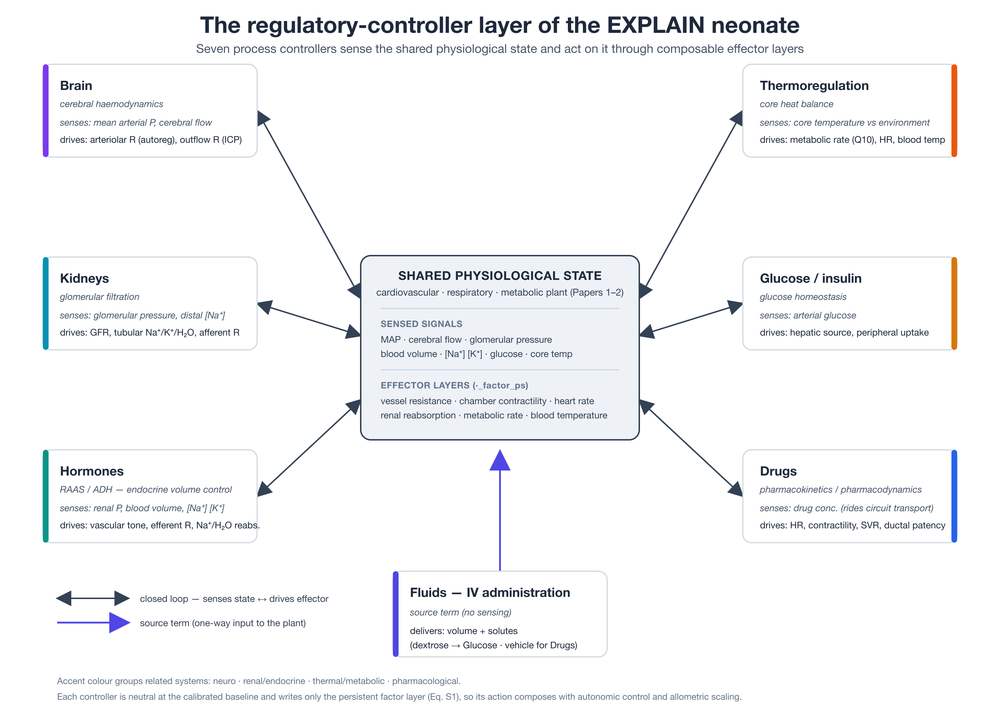

# An integrated model for simulation of neonatal physiology — homeostatic regulation: renal function, endocrine volume control, thermoregulation, glucose homeostasis and pharmacology

**Authors.** Antonius TAJ, van Meurs WL, Westerhof BE, de Boode WP.
*(author order / affiliations to be finalised)*

**Target journal.** *Pediatric Research.* Paper P3b of the EXPLAIN series (companion to the
cardiovascular [Paper 1], respiratory/gas-exchange [Paper 2], cerebral-haemodynamics [P3a],
AI-parameterization [Paper 6] and mechanical-support-device [Paper 4] papers). This is the
homeostatic-regulation thread refocused out of the former regulatory-organ omnibus; cerebral
autoregulation and intracranial pressure are developed in the companion paper [P3a].

---

## Abstract

*(Structured abstract — Pediatric Research Basic Science format. Prior long-form draft superseded.)*

**Background:** Beyond the cardiovascular and respiratory plant described in companion papers, whole-body neonatal physiology is governed by slower homeostatic organ systems that defend extracellular volume, temperature, glucose and the response to drugs. We model these systems in the EXPLAIN simulator.

**Methods:** Five process controllers — renal glomerular filtration, a renin–angiotensin–aldosterone/antidiuretic-hormone volume controller, thermoregulation, glucose/insulin homeostasis, and pharmacokinetic/pharmacodynamic drug action — plus an intravenous-fluid scheduler are derived from first principles. Each owns no compartment; it senses the shared state and writes onto other models' composable effective-value layers, is neutral at baseline, and localises each intervention to one interpretable lever. Behaviour was verified with a reproducible headless harness.

**Results:** Every model reproduces the expected physiology under perturbation: haemorrhage activates renin–angiotensin–aldosterone and antidiuretic hormone with avid sodium retention; cold stress engages non-shivering thermogenesis; dextrose raises glucose and insulin; and an adrenaline bolus transiently raises heart rate, contractility and pressure before first-order washout.

**Conclusion:** These composable, auto-neutral controllers close the homeostatic loops that make the EXPLAIN neonate behave as an integrated organism; patient-specific parameters are set by the series' AI-assisted calibration. Cerebral autoregulation and intracranial pressure are described in the companion paper [P3a].

---

## 1. Introduction

The companion papers describe the mechanical plant of the neonate: the cardiovascular circuit
and its beat-to-beat autonomic control [Paper 1], and the respiratory system, pulmonary gas
exchange and acid–base chemistry [Paper 2]. A plant, however, is not an organism. What makes
an intact neonate hold its arterial pressure, extracellular volume, plasma
electrolytes, temperature and blood glucose within narrow limits — and what makes a *sick*
neonate fail to — is a set of slower **homeostatic organ systems** layered on top of that plant.
This paper describes the mathematical models of those systems in EXPLAIN.

Five of the six models share a common architecture that distinguishes them from the
compartment models of Papers 1–2. They own no blood or gas volume of their own; instead each is a **process controller** that senses a small number of state variables (an arterial pressure, a blood volume, a solute concentration, a temperature), runs its control law on a slow update
interval, and writes its output onto *effector channels* belonging to other models — a
resistance factor on a named vessel, a reabsorption factor in the kidney, a metabolic-rate
multiplier, a contractility multiplier on a heart chamber. The sixth, the intravenous-fluid
scheduler, is a source term. Every controller is constructed to be **neutral at the scenario
baseline**: at the calibrated operating point its effector factors are unity and it perturbs
nothing, so that enabling or disabling it does not move the steady state. It acts only when the
state departs from its (usually auto-seeded) set-point. This design lets an arbitrary subset of
regulatory systems be switched on for a given scenario without recalibrating the plant, and it
localises each clinical intervention to one physiologically interpretable lever — the property
the AI-parameterization method (Paper 6) exploits.

The models span the homeostatic organ systems that dominate neonatal intensive care. (Cerebral autoregulation and intracranial pressure — the haemodynamic regulator of the brain — are developed in the companion paper [P3a]; the systems described here defend the body's internal volumetric, chemical and thermal milieu.) The **kidney** converts a passive renal vascular bed into an active filter — glomerular filtration driven by the Starling balance of hydrostatic and oncotic pressures, followed by per-solute tubular reabsorption — and optionally defends its own filtration rate by myogenic and tubuloglomerular-feedback autoregulation. The **renin–angiotensin–aldosterone and antidiuretic-hormone** axis is the slow neuro-hormonal counterpart to the fast baroreflex of Paper 1, defending volume and osmolality by
adjusting vascular tone and renal sodium/water handling. **Thermoregulation** matters
disproportionately in a neonate, which has a high surface-to-mass ratio, cannot shiver, and
defends its temperature by non-shivering (brown-fat) thermogenesis; core temperature in turn
feeds back onto metabolic rate, heart rate and the temperature-dependence of the blood-gas
solver. **Glucose/insulin** homeostasis and a general **pharmacokinetic/pharmacodynamic** drug
model complete the regulatory layer; the drug model reuses the same advective circuit transport
that carries blood gases and electrolytes (Paper 2), so a drug injected into a central vein
distributes, is cleared by perfused organs, and acts on cardiovascular targets exactly as a real
agent would.

We describe each model conceptually and mathematically, give the provenance of its parameters, and demonstrate its behaviour with engine-driven simulations. As throughout the series, the aim is a rigorous, reproducible description of the models, not a formal clinical validation; every quantitative result is reproduced from the engine rather than asserted.

---

## 2. Methods

### 2.1 Conceptual model — the process-controller pattern

The six regulatory models of this paper share a common architecture, summarised in Figure 1:
each senses a small number of variables from the shared cardiovascular/respiratory/metabolic
state, runs a control law, and writes its output back onto that state through the engine's
composable effector layers, closing a control loop around the plant of Papers 1–2.

**Figure 1.** The homeostatic-controller layer. Five process controllers (Kidneys, Hormones,
Thermoregulation, Glucose, Drugs) form closed loops with the shared physiological state — sensing a state variable and driving an effector channel — while the intravenous-fluid scheduler (Fluids) is a one-way source term. Every controller owns no compartment of its own, is neutral at the calibrated baseline, and writes only the persistent factor layer (Eq. S1), so its action composes additively with autonomic control (Paper 1) and allometric scaling (Paper 6) rather than overwriting them. Accent colours group related systems (renal/endocrine; thermal/metabolic; pharmacological). *(Figure to be updated to remove the Brain node, now in the companion paper [P3a].)*

The five controllers (Kidneys, Hormones, Thermoregulation, Glucose, Drugs) and the fluid
scheduler share the following structure, which we state once and do not repeat per model:

1. **No owned compartment.** The controller resolves references to the compartments and
   resistors it senses and drives lazily, at initialisation, from the engine model map.
2. **Slow update interval.** Rather than recomputing every integration step Δ*t* (default
   0.0005 s), each controller accumulates elapsed time and runs its control law once per update interval τ_u (1.0 s for the slow endocrine/thermal/glucose loops; 0.015 s for the fast
   renal-autoregulation loop; every step for Drugs). The elapsed interval *u* is
   passed to the update so the discrete integration is exact regardless of τ_u.
3. **Owned effector channels, released on disable.** While enabled, the controller writes its
   outputs onto persistent factor layers (`*_factor_ps`) of other models — never their base
   parameters — so its action composes additively with scenario settings, autonomic control and allometric scaling through the effective-value law of Eq. (S1) (shared Methods S2). When disabled it restores every channel it owns to unity exactly once.
4. **Auto-seeded neutrality.** After a short warm-up delay the controller pins its set-point(s)
   to the current calibrated state, so that at baseline its error signal is zero and its
   effectors are unity.

Two numerical helpers recur. A first-order lag integrates a state *x* toward a target *x*\* with
time constant τ using the explicit-Euler discretisation of *ẋ* = (*x*\* − *x*)/τ:

> **(1)**  *x* ← *x* + *u* · (1/τ) · (*x*\* − *x*)

and a clamp restricts a factor to a physiological window [*a*, *b*]. Both appear in every model
below; we write lag(*x* → *x*\*; *u*, τ) and clamp(·, *a*, *b*) for them.

### 2.2 Mathematical models

Notation and units follow shared Methods S1. Compartment abbreviations used here: **AA**
ascending aorta (systemic arterial sample); **KID_ART/KID_CAP/KID_VEN** renal artery/capillary
(glomerulus)/vein; **IVCI** the intra-abdominal caval (central-venous) injection site.

#### 2.2.1 Renal glomerular filtration (`Kidneys`)

**Concept.** The renal bed KID_ART → KID_CAP → KID_VEN becomes an active nephron: the glomerular capillary filters plasma into Bowman's space at a rate set by the Starling net filtration
pressure and a filtration coefficient; the tubule then reabsorbs a large, hormonally modulated
fraction of the filtered water and of each filtered solute by explicit mass balance; the
un-reabsorbed remainder flows into an owned URINE reservoir. An optional autoregulation loop
holds the glomerular filtration rate (GFR) constant against changing renal arterial pressure by
adjusting the afferent arteriolar resistance.

**Effective filtration coefficient.** The base coefficient *K*_f passes through the standard
three-layer effective-value stack of Eq. (S1) (non-persistent, persistent, and allometric-scaling
factors), giving *K*_f^eff; the effective water-reabsorption fraction FR_w^eff combines the base
fraction with the same layers *multiplicatively* plus an antidiuretic-hormone channel *f*_adh
(written by the Hormones model, §2.2.2), clamped below unity:

> **(10)**  FR_w^eff = clamp( FR_w · *f*_r · *f*_{r,ps} · *f*_{r,sc} · *f*_adh, 0, 0.9999 ).

**Starling filtration.** Net filtration pressure is the glomerular capillary hydrostatic pressure
minus Bowman-space pressure minus the plasma colloid oncotic pressure, the last rising with
haemoconcentration (self-limiting):

> **(11)**  π = π₀ · [alb]/[alb]_ref

> **(12)**  NFP = max( 0, *P*_glom − *P*_Bowman − π )   [mmHg]

> **(13)**  GFR = *K*_f^eff · NFP   [L·s⁻¹];   *Q*_urine = GFR · (1 − FR_w^eff)   [L·s⁻¹]

with *P*_Bowman = 8 mmHg, π₀ = 18 mmHg at reference albumin [alb]_ref = 25 g·L⁻¹, and FR_w = 0.985
by default. GFR is reported in mL·min⁻¹ (× 6·10⁴) and the sodium fractional excretion as
FE_Na = (1 − fr_Na)·100 %.

**Tubular mass balance.** Over one update the filtrate volume is *V*_f = GFR·Δ*t*; urine water is
*U*_w = *V*_f (1 − FR_w^eff). For each filterable solute *s* the excreted mass is bounded by what
is present, and blood and urine concentrations are updated by conservation:

> **(14)**  *M*_x^s = min( *V*_f · *C*_s · (1 − fr_s), *C*_s · *V*⁺ )

> **(15)**  *C*_s⁻ = (*C*_s · *V*⁺ − *M*_x^s) / *V*⁻,   *C*_s^urine = (*C*_s^urine,old·*V*_u^old + *M*_x^s)/(*V*_u^old + *U*_w)

where *V*⁺, *V*⁻ are the glomerular-capillary volume before and after water removal. Filtration is
implemented as an explicit solute-by-solute transfer rather than the generic volume-mixing of
Eq. (S2), precisely so that non-filtered species (albumin, haemoglobin) are *not* copied into the
filtrate; those are instead haemoconcentrated, *C*_s⁻ = *C*_s⁺·(*V*⁺/*V*⁻), which avoids
artefactual proteinuria and progressive plasma-protein loss. The filterable set is {Na, K, Ca,
Cl, lactate, Mg, phosphate, unmeasured anions}. Each solute's effective reabsorbed fraction is

> **(16)**  fr_s = clamp( (RF_s or FR_w^eff) · φ_s, 0, 0.9999 )

where RF_s is an optional absolute per-solute set-point and φ_s is a hormonal multiplier written
by the Hormones model — the channel through which aldosterone retains sodium (φ_Na > 1) and wastes potassium (φ_K < 1).

**GFR autoregulation (optional).** When enabled, a myogenic limb responds to renal arterial
pressure and a tubuloglomerular-feedback (TGF) limb responds to distal solute delivery
(approximated by GFR·[Na]); their product, clamped and lagged, sets the afferent arteriolar
resistance factor:

> **(17)**  act = clamp(*p*, *p*_min, *p*_max) − *p*_set;   myo\* = max(1 + *g*_myo·act, 0.05)

> **(18)**  *S*_TGF = GFR·[Na]_{KID_CAP};   tgf\* = max(1 + *g*_tgf·(*S*_TGF − *S*^set)/*S*^set, 0.05)

> **(19)**  *f*_aff ← lag( *f*_aff → clamp(myo·tgf, 0.5, 4.0); τ_apply ),   *r*^{ps}_{KID_ART} = *f*_aff.

Because the sensed variable is the *upstream* renal arterial pressure, the loop is intrinsically
negative feedback (sense high → constrict → pressure and delivery fall). This limb is disabled by
default in the neonatal scenarios (GFR is pressure-passive over the neonatal operating range) and enabled where autoregulation is being studied; the shipped scenario-calibration constants for the limbs differ from the class defaults quoted here and are tabulated in `docs/engine/Kidneys.md`.

Parameter provenance: the Starling glomerular model and the ~99 %/~1 % filtered-fraction/FE_Na partition are textbook renal physiology; the myogenic + TGF two-limb autoregulation follows the standard renal-autoregulation literature (Burke et al. 2014).

#### 2.2.2 Endocrine volume control — RAAS and ADH (`Hormones`)

**Concept.** The slow neuro-hormonal controller of extracellular volume and osmolality, the
counterpart to the fast baroreflex of Paper 1. It models three hormone activities as
dimensionless levels (1.0 = resting baseline) — renin/angiotensin II, aldosterone, and
antidiuretic hormone (ADH/vasopressin) — and writes them onto systemic vascular tone and renal sodium/water handling. It runs on a 1 s interval (hormones are slow).

**Sensing and hormone dynamics.** From renal perfusion pressure *p* (KID_ART), circulating volume *V* (Circulation total blood volume), and arterial Na⁺/K⁺ (with osmolality proxy 2·[Na]), the
model forms fractional errors ε_p, ε_V, ε_osm, ε_K against auto-seeded set-points and drives:

> **(20)**  renin = clamp( 1 + *g*_r·ε_p + *g*_rV·ε_V, 0, 8 );   AngII ← lag(AngII → renin; *u*, τ_ang)

> **(21)**  aldo\* = clamp( 1 + *g*_a·(AngII−1) + *g*_aK·ε_K, 0, 8 );   aldo ← lag(aldo → aldo\*; *u*, τ_aldo)

> **(22)**  adh\* = clamp( 1 + *g*_o·ε_osm + *g*_b·ε_V, 0, 8 );   adh ← lag(adh → adh\*; *u*, τ_adh)

with renin gains *g*_r = *g*_rV = 3.0, angiotensin lag τ_ang = 30 s, aldosterone gains (*g*_a =
1.0, *g*_aK = 2.0) and a deliberately slow τ_aldo = 1800 s (physiological ~30 min, compressed for demonstrations), and ADH gains (osmotic *g*_o = 4.0, baroregulatory *g*_b = 1.0) with τ_adh = 120
s.

**Effectors.** Angiotensin II and ADH raise systemic arterial and venous tone; angiotensin II
constricts the renal *efferent* arteriole (defending glomerular pressure); aldosterone sets the
renal Na/K reabsorption multipliers and ADH sets the renal water-reabsorption channel:

> **(23)**  svr_art = clamp(1 + *g*_sA(AngII−1) + *g*_sD(adh−1), 0.5, 5) → Circulation.svr_factor_art

> **(24)**  φ_Na = 1 + *g*_Na(aldo−1),  φ_K = 1 − *g*_K(aldo−1),  *f*_adh = 1 + *g*_w(adh−1)

routed to Kidneys.reabsorption_factors.na/.k and Kidneys.reabs_factor_adh respectively (Na window [0.95, 1.02], K [0.2, 1.5], water [0.5, 1.03]). Critically, the model writes the renal *efferent*
resistance (KID_CAP_KID_VEN) and never the *afferent* — which is owned by the Kidneys
autoregulation loop (§2.2.1). This afferent/efferent division of labour is what lets the two
renal controllers compose without collision, and it mirrors the physiology (angiotensin II acts
preferentially on the efferent arteriole).

Parameter provenance: the RAAS and ADH signalling structure and effector targets are standard
endocrine physiology; the compressed aldosterone time constant is a documented modelling choice (Gilbert 2025; Bie et al. 2004).

#### 2.2.3 Thermoregulation (`Thermoregulation`)

**Concept.** A single well-mixed core-temperature node whose temperature is the running balance
of metabolic heat production against radiative, convective and evaporative loss. Because a neonate cannot shiver, cold defence is by non-shivering (brown-fat) thermogenesis; core temperature feeds back onto metabolic rate (a Q10 effect), heart rate, and blood temperature (which enters the acid–base/O₂-dissociation solver of Paper 2). It runs on a 1 s interval.

**Heat production.** Metabolic heat is the effective oxygen consumption converted by the caloric
equivalent of oxygen; brown-fat heat is proportional to the temperature deficit below set-point,
capped per unit mass:

> **(25)**  *Q*_met = ( *V̇*_O2,eff · *m* / 60 ) · *k*_cal   [W],   *V̇*_O2,eff = *V̇*_O2·*f*_vo2·*f*_vo2,T

> **(26)**  *Q*_bat = clamp( *g*_bat·(*T*_sp − *T*_c), 0, *q̇*_bat,max·*m* ) for *T*_c < *T*_sp, else 0

> **(27)**  *Q*_prod = *Q*_met + *Q*_bat

with *k*_cal = 20.1 J·mL⁻¹, *g*_bat = 6.0 W·°C⁻¹, *q̇*_bat,max = 4.5 W·kg⁻¹, *T*_sp = 37 °C.

**Heat loss.** Body surface area follows the Meeh allometric law SA = *k*_SA·*m*^{2/3}, reflecting
the high surface-to-mass ratio of the neonate; loss is the sum of radiative, convective and
evaporative terms, plus a constant trim *ℓ*_trim auto-seeded once so that at *T*_c = *T*_sp loss
exactly equals production (baseline neutrality):

> **(28)**  *Q*_loss,raw = SA·[ *h*_r(*T*_c − *T*_rad) + *h*_c(*T*_c − *T*_env) ] + SA·*k*_evap(1 − RH)

> **(29)**  *Q*_loss,eff = *Q*_loss,raw + *ℓ*_trim

with *k*_SA = 0.05, *h*_r = 5.5, *h*_c = 4.0 W·m⁻²·K⁻¹, *k*_evap = 6.0 W·m⁻², RH = 0.5, incubator
air *T*_env = 32 °C (a neutral-thermal default).

**Core integration and effectors.** With thermal mass *C*_th = *m*·*c*_p (*c*_p = 3470 J·kg⁻¹·K⁻¹),

> **(30)**  Δ*T*_c = ( *Q*_prod − *Q*_loss,eff ) / *C*_th · *u*

and the effectors are a Q10 metabolic factor, a heart-rate factor, and blood temperature:

> **(31)**  *f*_vo2,T = clamp( Q10^{(T_c − 37)/10}, 0.5, 2.5 ) → Metabolism

> **(32)**  *f*_hr,T = clamp( 1 + *g*_hr·(*T*_c − *T*_sp), 0.6, 1.6 ) → Heart;   Blood.set_temperature(*T*_c)

with Q10 = 2.3 and *g*_hr = 0.1 (≈10 % per °C). The core → VO₂ → heat → core limb is positive
feedback, bounded by the dominant heat-loss term (∝ *T*_c − *T*_env) and the Q10 clamp.

Parameter provenance: the Meeh surface-area law, the caloric equivalent of oxygen, and the Q10
metabolic coefficient are classical; non-shivering thermogenesis as the neonatal cold-defence
mechanism is standard neonatal physiology (Lidell 2019; Tews & Wabitsch 2011).

#### 2.2.4 Glucose homeostasis (`Glucose`)

**Concept.** Blood glucose is carried as a new blood solute (mmol·L⁻¹) that advects through the
circuit by the same volume-mixing as electrolytes (Eq. S2). The controller senses arterial
glucose, drives an insulin and a counter-regulatory hormone level, and sets a hepatic **source**
(into the central vein IVCI) and a peripheral **sink** distributed over the same metabolic
consumption sites the Metabolism model uses; it is mass-balanced (production = utilisation) at the seeded set-point. It runs on a 1 s interval.

**Controller.** With fractional glucose error ε_g = (*G* − *G*_sp)/*G*_sp,

> **(33)**  *I*\* = clamp(1 + *g*_I·ε_g, 0, 10),   *R*\* = clamp(1 − *g*_R·ε_g, 0, 10)

> **(34)**  *f*_up = clamp(1 + *a*_up(*I*−1), 0.1, 5),   *f*_pr = clamp(1 − *a*_hI(*I*−1) + *a*_hR(*R*−1), 0, 8)

with insulin and counter-regulatory gains *g*_I = *g*_R = 6.0, both lagged with τ = 120 s, uptake
sensitivity *a*_up = 1.0, and hepatic sensitivities *a*_hI = 0.8 (insulin-suppressed) and *a*_hR =
2.0 (counter-regulation-stimulated). *G*_sp = 4.0 mmol·L⁻¹.

**Fluxes.** Over an update the peripheral sink and hepatic source are

> **(35)**  *U*_tot = (*r*_use·*m*/60)·*u*·*f*_up   [mmol], distributed by metabolic fraction φ_i

> **(36)**  *P*_tot = (*r*_hgp·*m*/60)·*u*·*f*_pr   [mmol], added to *c*_IVCI

with utilisation and hepatic-production rates *r*_use = *r*_hgp = 0.03 mmol·kg⁻¹·min⁻¹ (≈5.4
mg·kg⁻¹·min⁻¹, and equal by construction so the model is neutral at rest). Intravenous dextrose is
not handled here but enters through the Fluids model (§2.2.6) as a glucose-bearing fluid; glucose is deliberately excluded from the renal filterable set so there is no glucosuria in this version.

Parameter provenance: the ~5–6 mg·kg⁻¹·min⁻¹ neonatal glucose turnover and the insulin/
counter-regulation antagonism are standard neonatal metabolic physiology (Bier et al. 1977).

#### 2.2.5 Pharmacology — PK/PD (`Drugs`)

**Concept.** A general pharmacokinetic/pharmacodynamic model. Drug mass injected into a blood
compartment advects through the whole circuit by volume-mixing (Eq. S2), is eliminated by a
diffuse whole-body term plus organ-localised intrinsic clearance at perfused organs, optionally
lags into an effect compartment, and acts through sigmoid Emax pharmacodynamics on shared
cardiovascular effector channels. The concentration unit is mcg·L⁻¹ ≡ ng·mL⁻¹ throughout. It runs
every integration step.

**Dosing (source).** A bolus *D* (mcg) or a continuous infusion at rate *r* (mcg·kg⁻¹·min⁻¹) raises
the injection-site concentration:

> **(37)**  bolus: *C*_inj += *D*/*V*_inj;   infusion: *C*_inj += (*r*·*m*/60)·Δ*t* / *V*_inj.

**Clearance (sink).** Every compartment loses drug by a diffuse first-order term (metabolism,
uptake), and named clearing organs additionally apply an intrinsic first-order term; because those organs are continuously perfused, this yields flow-scaled whole-body clearance (a well-stirred organ model — if organ perfusion falls, the drug lingers):

> **(38)**  *C* ← max(*C* − *C*·*k*_g·Δ*t*, 0)   (all compartments);   *C* ← max(*C* − *C*·*k*_site·Δ*t*, 0)   (clearing organs)

**Biophase and effect.** An optional effect-compartment lag *dC*_e/*dt* = *k*_e0(*C*_site − *C*_e)
(disabled, *k*_e0 = 0, for all default drugs → the driving concentration is the site concentration
directly) precedes a sigmoid Emax response summed across enabled drugs onto each channel:

> **(39)**  *E*(*C*) = *E*_max·*C*^n / (EC₅₀^n + *C*^n)

> **(40)**  *f*_X = 1 + Σ_d *E*_{d,X}(*C*_{d,drive}),   X ∈ {HR, contractility, SVR, ductal patency}

routed to Heart.hr_drug_factor, each chamber's el_max_drug_factor, Circulation.svr_factor_drug and Pda.diameter_drug_factor. Three agents are provided (Table 1): adrenaline and noradrenaline (with diffuse plus renal/hepatic clearance and distinct HR/contractility/SVR Emax profiles) and prostaglandin E1 (alprostadil, brisk clearance reflecting ~80 % pulmonary first-pass metabolism; acts only on ductal patency, for duct-dependent congenital heart disease — the ductal physiology itself is described in Paper 1). Newly added built-in drugs merge under any scenario-baked definitions, so they become available in old scenarios without rebaking.

**Table 1.** Default drug PK/PD parameters (transcribed from `Drugs.js`). Clearance in s⁻¹; EC₅₀ in
ng·mL⁻¹; *E*_max as maximal fractional change on its channel; Hill exponent *n*.

| Drug | diffuse *k*_g | organ *k*_site | HR (EC₅₀, *E*_max, *n*) | contractility | SVR | ductal |
|---|---|---|---|---|---|---|
| adrenaline | 0.022 | KID 0.6, LS 0.9, INT 0.4 | 20, 0.6, 1.5 | 25, 0.8, 1.5 | 40, 0.5, 2.0 | — |
| noradrenaline | 0.018 | KID 0.6, LS 1.0, INT 0.4 | 30, 0.1, 1.5 | 30, 0.35, 1.5 | 25, 0.9, 2.0 | — |
| prostaglandin E1 | 0.08 | — | — | — | — | 0.02, 1.5, 1.0 |

Parameter provenance: the Emax/Hill pharmacodynamic form and the effect-compartment (ke0) concept are standard clinical pharmacology; the catecholamine and alprostadil parameter bands are set to place clinical dose ranges on the rising limb of the sigmoid (Sheiner et al. 1979; Holford & Sheiner 1981).

#### 2.2.6 Intravenous fluid administration (`Fluids`)

**Concept.** A scheduler with no volume of its own. Each queued fluid is delivered as a stream of
small volume increments (with its solute composition) into a target blood compartment through that compartment's volume-in mixing, over a prescribed infusion time. A fluid carries no oxygen or CO₂ and low viscosity, so a large bolus haemodilutes the compartment's gas content and viscosity — the intended effect.

**Delivery.** For a volume *V* (L) over infusion time *t*_in with update interval Δ*t*_u (0.015 s),
the per-step increment is δ = *V*·Δ*t*_u/*t*_in; each update delivers δ into the target site,
decrements the remaining volume and the timer, and stops when the timer expires. The increment is delivered *before* the timer is zeroed, so that even a single-step bolus delivers its full dose:

> **(41)**  site.volume_in(δ, fluid);   *V* −= δ;   *t*_left −= Δ*t*_u.

The scenario supplies the fluid library (e.g. normal saline, Ringer's lactate, packed cells,
albumin, and the dextrose solutions D5/D10 that couple to the Glucose model, §2.2.4). This is the common delivery path for volume resuscitation, maintenance fluids, blood products and the drug/ dextrose vehicles used elsewhere in the model.

### 2.3 Software implementation

As described in shared Methods S5: EXPLAIN is a framework-agnostic JavaScript/TypeScript engine running in a Web Worker, with scenarios defined declaratively as JSON. Each model of §2.2 is a self-contained module whose `calc_model()` implements the equations above; the models run in insertion order each step, gated on being enabled and initialised. The regulatory controllers of this paper are ordinary such modules that happen to write onto other models' effector layers rather than owning a compartment, and they participate in the same step loop, data collection and task scheduling as the plant models. The interactive model is freely available at https://explain-modeling.com; the complete, annotated engine source code is publicly available at ‹repository URL› and archived with a persistent identifier at ‹Zenodo/archive DOI›.

### 2.4 AI-assisted parameterization (pointer)

Patient-specific parameter values in EXPLAIN are not tuned by hand but set by the AI-assisted,
closed-loop calibration pipeline described in Paper 6 (shared Methods S6): a large language model interprets the available clinical targets and emits a validated specification, and a deterministic calibrator drives one physiologically interpretable lever per target to within a
clinician-meaningful tolerance. The regulatory models of this paper contribute both **levers** and
**guarded loops** to that pipeline. As levers, their set-points and gains individualise a patient
(e.g. the renal filtration coefficient *K*_f for GFR; the thermoregulatory environment *T*_env for incubator setting). As guarded loops, they must be *respected* by the calibrator: because the RAAS/ADH axis defends arterial pressure and volume, a naïve pressure lever is opposed by the controller — the same class of interaction the baroreflex creates in Paper 1 — so the calibrator drives pressure through a resistance lever that composes with, rather than fights, the hormonal effector (see Paper 6 §3.2 and the shared-methods lever table).

---

## 3. Results — illustrative simulations

All simulations use the calibrated `term_neonate` scenario unless noted, run headless through the engine's message protocol (shared Methods S7). Each subsection names the probe script that produced it. Where a controller interacts with the autonomic baroreflex, the baroreflex was
disabled (`Ans.is_enabled = false`) to isolate the system under study, as noted.

### 3.1 Renal filtration and neuro-hormonal volume control

`scripts/probe_renal.mjs` (Kidneys and Hormones together). At the calibrated baseline the kidney filters at a glomerular filtration rate of 4.46 mL·min⁻¹ with a urine output of 0.089 mL·min⁻¹ and a sodium fractional excretion of ~1 %, and the hormone levels sit near their resting values (Table 2; aldosterone 0.98, ADH 1.01 — renin is slightly suppressed at 0.83 because the calibrated renal perfusion pressure of 42 mmHg is marginally above the model's 40 mmHg set-point, a minor baseline-calibration offset). A 10 % haemorrhage lowers renal perfusion pressure and drives the integrated renal–endocrine response: glomerular filtration falls (4.46 → ~3.2 mL·min⁻¹, following the drop in Starling net filtration pressure), while the Hormones controller activates — renin and angiotensin II roughly double, aldosterone climbs progressively (0.98 → 1.25 over 30 min, its slow time constant visible), and ADH rises (1.01 → 1.13). The endocrine output closes onto the tubule: the sodium fractional excretion falls steadily from 1.02 % to 0.76 % as aldosterone raises the sodium-reabsorption factor — avid sodium retention, the expected defence of extracellular volume. A larger (20 %) haemorrhage drives glomerular filtration to zero (prerenal anuria) with the same hormonal pattern, confirming the graded behaviour.

**Table 2.** Renal and endocrine response to a 10 % haemorrhage (`probe_renal.mjs`, term_neonate; means/instantaneous at each epoch). GFR and urine in mL·min⁻¹; hormone levels dimensionless (1 = resting); FE_Na in %.

| Epoch | renal *P* | GFR | urine | FE_Na | renin | AngII | aldosterone | ADH |
|---|---|---|---|---|---|---|---|---|
| rest | 42.1 | 4.459 | 0.089 | 1.02 | 0.83 | 0.93 | 0.98 | 1.01 |
| bleed +300 s | 36.8 | 3.145 | 0.058 | 0.96 | 1.54 | 1.45 | 1.04 | 1.10 |
| bleed +900 s | 39.0 | 3.148 | 0.058 | 0.86 | 1.61 | 1.47 | 1.15 | 1.12 |
| bleed +1800 s | 38.3 | 3.354 | 0.061 | 0.76 | 1.40 | 1.50 | 1.25 | 1.13 |

### 3.2 Thermoregulation

`scripts/probe_thermo.mjs`. At rest the core sits at 37.0 °C with heat production exactly matched to loss (9.62 W each, by the auto-seeded loss trim), the heart-rate and metabolic factors at unity, and blood temperature equal to core (Table 3, row 1). Dropping the incubator air from 32 to 24 °C raises heat loss to ~18 W; the core falls slowly (to 36.6 °C at 10 min), non-shivering thermogenesis engages (brown-fat heat rising from 0 to 2.2 W), the Q10 factor falls below unity (0.97, reducing metabolic rate as the tissue cools) and heart rate falls (131 → 127 min⁻¹) — the cold-stressed neonate. A hot environment (40 °C) reverses every sign: the core climbs above set-point (to 37.8 °C at 25 min), the Q10 factor exceeds unity (1.07) and heart rate rises (131 → 144 min⁻¹). Blood temperature tracks the core throughout (feeding the temperature term of the acid–base/O₂-dissociation solver of Paper 2).

**Table 3.** Thermoregulatory response to a cold then a hot environment (`probe_thermo.mjs`,
term_neonate; incubator air stepped 32 → 24 °C, re-equilibrated, then → 40 °C).

| Epoch | core (°C) | AA temp | HR (min⁻¹) | HR factor | Q10 factor | *Q*_prod (W) | *Q*_loss (W) | brown-fat (W) |
|---|---|---|---|---|---|---|---|---|
| rest | 37.00 | 37.00 | 130.9 | 1.000 | 1.000 | 9.62 | 9.62 | 0.00 |
| cold +120 s | 36.92 | 36.92 | 130.0 | 0.992 | 0.993 | 10.04 | 18.36 | 0.49 |
| cold +300 s | 36.80 | 36.80 | 127.7 | 0.980 | 0.984 | 10.65 | 18.23 | 1.19 |
| cold +600 s | 36.63 | 36.63 | 126.9 | 0.963 | 0.970 | 11.55 | 18.05 | 2.22 |
| warm +300 s | 36.97 | 36.97 | 133.2 | 0.997 | 0.997 | 9.80 | 0.75 | 0.20 |
| warm +900 s | 37.39 | 37.39 | 138.5 | 1.039 | 1.033 | 9.94 | 1.22 | 0.00 |
| warm +1500 s | 37.82 | 37.82 | 143.5 | 1.082 | 1.070 | 10.30 | 1.69 | 0.00 |

### 3.3 Glucose homeostasis

`scripts/probe_glucose.mjs`. At rest arterial glucose holds at its seeded set-point (4.04 vs 4.06 mmol·L⁻¹) with insulin and counter-regulation ≈1 (Table 4). A 2 mL bolus of 10 % dextrose into the central vein raises arterial glucose to 7.4 mmol·L⁻¹ at 30 s; insulin rises (peaking at 3.6 as the lagged signal integrates) and hepatic production is fully suppressed (factor 0), and by 10 min
glucose has recovered to set-point (4.05 mmol·L⁻¹). Conversely, suppressing hepatic glucose output (*r*_hgp 0.03 → 0.005) produces hypoglycaemia (to 3.5 mmol·L⁻¹) with a compensatory rise in counter-regulation (to 1.8) and hepatic-production factor (to 3.3), stabilising glucose above the un-defended level without numerical failure.

**Table 4.** Glucose homeostasis (`probe_glucose.mjs`, term_neonate).

| Epoch | arterial glucose | set-point | insulin | counter-reg | uptake factor | production factor |
|---|---|---|---|---|---|---|
| rest | 4.039 | 4.064 | 1.012 | 0.988 | 1.012 | 0.967 |
| dextrose +30 s | 7.405 | 4.064 | 2.231 | 0.798 | 2.231 | 0.000 |
| dextrose +120 s | 5.796 | 4.064 | 3.626 | 0.376 | 3.626 | 0.000 |
| dextrose +600 s | 4.053 | 4.064 | 1.208 | 0.870 | 1.208 | 0.574 |
| low hepatic output +300 s | 3.523 | 4.064 | 0.194 | 1.824 | 0.194 | 3.291 |
| low hepatic output +900 s | 3.650 | 4.064 | 0.396 | 1.604 | 0.396 | 2.691 |

### 3.4 Pharmacology

`scripts/probe_drugs.mjs` (baroreflex off, so the drug effect is not masked by the reflex). A 5
mcg bolus of adrenaline into the central vein of the 3.5 kg term neonate distributes to the
arterial sample within seconds, peaking at ~42 ng·mL⁻¹ at 5 s (Table 5). The heart-rate,
contractility and systemic-vascular-resistance factors rise together (to 1.45, 1.55 and 1.26 at
peak), heart rate rises from 131 to 194 min⁻¹, and mean arterial pressure rises from 59 to 73 mmHg over the concentration peak. The drug then washes out by first-order clearance (42 → 3.5 ng·mL⁻¹ by 60 s → 0.66 by 120 s) and every effector returns toward baseline. Throttling the perfusion of the clearing organs (an eight-fold rise in their feeding-arteriolar resistance) slows the washout (concentration at 120 s rises from 0.66 to 0.85 ng·mL⁻¹), demonstrating the flow-scaled organ clearance of Eq. (38). Prostaglandin E1 reproduces the same PK/PD loop on the ductal-patency channel: in a duct-dependent lesion, an infusion re-opens a closing duct (patency factor 1 → 2.3, ductal flow 0.3 → 2.8 mL·s⁻¹) and its withdrawal closes it again (`probe_pge1.mjs`).

**Table 5.** Adrenaline 5 mcg bolus (`probe_drugs.mjs`, term_neonate, baroreflex off; concentration at the arterial sample AA).

| Time | HR (min⁻¹) | AA conc (ng·mL⁻¹) | HR factor | contractility factor | SVR factor |
|---|---|---|---|---|---|
| baseline | 130.9 | 0 | 1.00 | 1.00 | 1.00 |
| +5 s | 194.3 | 41.84 | 1.45 | 1.55 | 1.26 |
| +10 s | 166.2 | 23.94 | 1.34 | 1.39 | 1.13 |
| +30 s | 143.0 | 7.92 | 1.12 | 1.12 | 1.02 |
| +60 s | 135.3 | 3.45 | 1.04 | 1.04 | 1.00 |
| +120 s | 131.1 | 0.66 | 1.00 | 1.00 | 1.00 |

Arterial pressure (systolic/diastolic/mean, mmHg): baseline 72.9/45.7/58.9 → near concentration
peak 83.5/60.6/72.6.

### 3.5 Baseline homeostatic state against reference ranges

Beyond the perturbation responses above, the resting (neutral) operating point of each controller sits within its published neonatal reference range (Table 6) — the counterpart of the baseline blood-gas table in the respiratory companion [P2]. All values are the calibrated `term_neonate` baseline (3.5 kg) produced by the probes named above; the controllers are auto-neutral at this point (insulin and counter-regulatory tone at 1.0), so these are the states the perturbations of §3.1–3.4 move away from and return to.

**Table 6. Calibrated term-neonate homeostatic baseline versus published neonatal reference ranges.** *(Model values: `probe_renal.mjs`, `probe_thermo.mjs`, `probe_glucose.mjs`.)*

| Quantity | Baseline (model) | Reference (term neonate) |
|---|---|---|
| Glomerular filtration rate | 4.46 mL·min⁻¹ (≈ 35 mL·min⁻¹·1.73 m⁻²) | 20 (day 1) → 42 (day 7) mL·min⁻¹·1.73 m⁻² (Allegaert 2025; Gordjani 1988) |
| Urine output | 1.5 mL·kg⁻¹·h⁻¹ | 1–3 mL·kg⁻¹·h⁻¹ |
| Fractional sodium excretion | ~1 % | < 1–2.5 % |
| Core temperature | 37.0 °C | 36.5–37.5 °C |
| Arterial glucose | 4.0 mmol·L⁻¹ (72 mg·dL⁻¹) | 2.6–5.5 mmol·L⁻¹ |
| Insulin / counter-regulatory tone | 1.0 (resting) | dimensionless; 1 = rest |

Glomerular filtration matures two- to three-fold over the first postnatal week (Allegaert 2025); the calibrated value (≈ 35 mL·min⁻¹·1.73 m⁻²) therefore corresponds to the mid-to-late first week rather than to the lower day-1 figure, consistent with the term-neonate baseline representing a stabilised rather than a just-born infant.

---

## 4. Discussion

**What the regulatory layer adds.** The models of this paper close the control loops that turn the
cardiovascular and respiratory plant of Papers 1–2 into an integrated organism. Each is
deliberately minimal — a small number of sensed variables, one control law, a handful of
effector channels — but together they reproduce the defining regulatory behaviours of neonatal
intensive care: the Starling determinants of glomerular filtration, the neuro-hormonal defence of
volume and osmolality, non-shivering cold defence, glucose counter-regulation, and dose-dependent drug action with realistic distribution and clearance. Because every controller is neutral at the calibrated baseline, they can be composed in any subset onto a patient without disturbing the operating point the plant was calibrated to.

**Originality.** The contribution is not any single control law — each is a simplification of a
large physiological-modelling literature — but their *integration* on a shared, advective,
compartmental substrate and their construction as composable, auto-neutral controllers. Three
design choices are worth highlighting. First, effectors are written onto persistent factor layers
(Eq. S1), never base parameters, so that a hormonal, an autonomic, an allometric-scaling and an
AI-calibration adjustment to the same vessel resistance coexist additively rather than
overwriting one another. Second, the afferent/efferent division of renal control between the
Kidneys autoregulation loop and the Hormones model lets two independently authored controllers act on the same organ without collision, mirroring the physiology. Third, the drug model rides the same volume-mixing transport (Eq. S2) that carries blood gases and electrolytes, so pharmacokinetics — distribution, perfusion-limited organ clearance, the lingering of a drug when its clearing organ is hypoperfused — are emergent from the circulation rather than prescribed by a separate compartmental PK model.

**Validity and limitations.** As stated for the series, these are *illustrative* simulations
demonstrating that each model behaves qualitatively as intended, not a formal clinical validation
against patient data. Several simplifications should be explicit. (i) The controllers are
lumped and low-order: the kidney is a single nephron pool with a fixed filterable
solute set (and no glucosuria in this version); RAAS/ADH are three first-order signals, not a
receptor-level cascade. (ii) Some time constants are compressed for interactive demonstration
(most notably aldosterone, physiological ~30 min). (iii) Set-points are auto-seeded to the
calibrated baseline, so the models describe *regulation about* a calibrated operating point rather
than predicting that operating point from anatomy. (iv) The renal GFR-autoregulation limb is
disabled by default over the neonatal pressure range and its class-default constants differ from
the scenario calibration. (v) Parameter provenance, while grounded in classical physiology, is
reconciled against primary sources: the references are collected and PubMed-verified in
`_references.md` (confirmed 2026-07-12; see the reference list below), and where an engine constant departs from a textbook value (e.g. the compressed aldosterone τ) we have stated the engine value rather than silently "correcting" it.

**Validation strategy (series).** This paper validates homeostatic regulation — renal, endocrine, thermal, glucose and pharmacological control — in depth, in the directions and magnitudes its account is built on, against the cited literature, with the calibrated baseline sitting within published reference ranges (Table 6). Consistent with the series' two-altitude design, comprehensive quantitative validation of the AI-parameterized cohort as a whole, against published reference ranges and disease signatures, is centralized in the integrated flagship [P5], and the identifiability and one-lever-per-target basis of the parameterization is validated by the formal sensitivity analysis of [P6]. Validation throughout the series is to literature ranges and pattern, not to prospective individual-patient data.

**Coupling and future work.** The regulatory models are already cross-coupled — thermoregulation drives metabolic rate and the temperature term of the acid–base solver; glucose and drugs ride the circulation; the Hormones model drives both systemic tone and renal handling. Natural extensions include a multi-segment nephron with loop/distal/collecting
handling, receptor-level endocrine dynamics, additional drugs (the merge mechanism makes this low-cost), and a maternal–fetal coupling of the volume and drug models to the obstetric systems of a planned maternal–fetal companion (deferred from the current series).

---

## 5. Conclusion

The renal, endocrine, thermoregulatory, glucose and pharmacological models described
here provide the homeostatic closure of the EXPLAIN neonate. Each is a compact, auto-neutral,
composable controller that senses the shared physiological state and acts through the engine's
effective-value layers, and each reproduces the expected qualitative physiology under
perturbation. Together with the plant models of Papers 1–2 and the device models of Paper 4, they make the simulator behave as an integrated organism; and as throughout the series, their
patient-specific parameters are set by the AI-assisted calibration pipeline of Paper 6 rather than
by hand.

---

## References

*(Vancouver, in order of model appearance; renumber to citation order at final assembly. Sources
PubMed-verified 2026-07-12 (`thesis/_references.md`). Anchors shared with the cardiovascular paper —
Beneken & DeWit, Suga, van Meurs — are reused verbatim and not repeated here. Pre-MEDLINE/textbook
items (Meeh 1879 surface-area law; the Q10/van 't Hoff coefficient; the Starling principle) are cited
as historical/textbook sources, not PubMed entries.)*

*(Cerebral haemodynamics and intracranial-pressure references — Alderliesten 2012, Massaro 2015, Mokri 2001 — are in the companion paper [P3a].)*

**Renal function**
1. Maddox DA, Bennett CM, Deen WM, et al. Determinants of glomerular filtration in experimental glomerulonephritis in the rat. *J Clin Invest.* 1975;55(2):305–18. PMID 1127101. *(Starling determinants of SNGFR.)*
2. Burke M, Pabbidi MR, Farley J, Roman RJ. Molecular mechanisms of renal blood flow autoregulation. *Curr Vasc Pharmacol.* 2014;12(6):845–58. PMID 24066938. *(myogenic + tubuloglomerular feedback.)*

**Endocrine volume control (RAAS/ADH)**
3. Gilbert SJ. Sodium and water disorders. *Adv Kidney Dis Health.* 2025;32(1):41–49. PMID 40175029.
4. Bie P, Wamberg S, Kjolby M. Volume natriuresis vs. pressure natriuresis. *Acta Physiol Scand.* 2004;181(4):495–503. PMID 15283763.

**Thermoregulation & non-shivering thermogenesis**
5. Lidell ME. Brown adipose tissue in human infants. *Handb Exp Pharmacol.* 2019;251:107–123. PMID 29675580.
6. Tews D, Wabitsch M. Renaissance of brown adipose tissue. *Horm Res Paediatr.* 2011;75(4):231–9. PMID 21372557.
7. Meeh K. Oberflächenmessungen des menschlichen Körpers. *Z Biol.* 1879;15:425–458. *(historical; body-surface-area law — not in PubMed.)*

**Glucose homeostasis**
8. Bier DM, Leake RD, Haymond MW, et al. Measurement of "true" glucose production rates in infancy and childhood with 6,6-dideuteroglucose. *Diabetes.* 1977;26(11):1016–23. PMID 913891.

**Pharmacokinetics/pharmacodynamics**
9. Sheiner LB, Stanski DR, Vozeh S, Miller RD, Ham J. Simultaneous modeling of pharmacokinetics and pharmacodynamics: application to d-tubocurarine. *Clin Pharmacol Ther.* 1979;25(3):358–71. PMID 761446.
10. Holford NHG, Sheiner LB. Understanding the dose-effect relationship: clinical application of pharmacokinetic-pharmacodynamic models. *Clin Pharmacokinet.* 1981;6(6):429–53. PMID 7032803.
