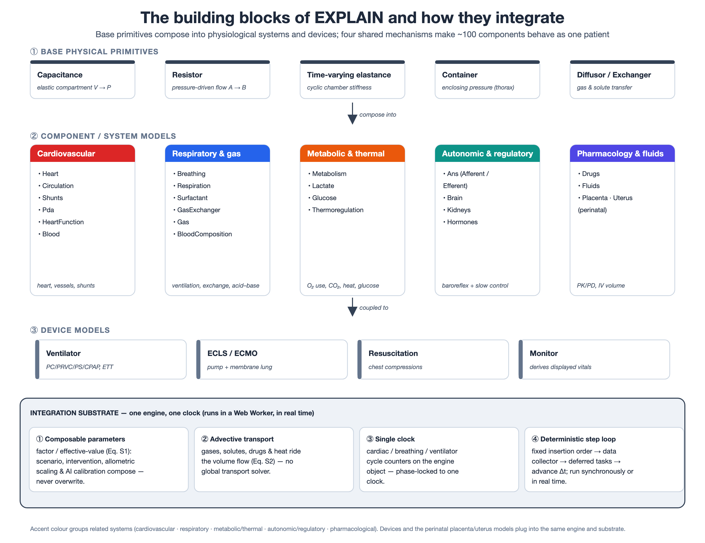

# Chapter 1 — General Introduction

*Connective chapter of the compilation thesis. It provides the background and purpose of EXPLAIN,
introduces its building blocks and the way they integrate into a single virtual patient, states the
parameterization problem that motivates the methodological core of the thesis, and sets out the aims
and outline. The per-system mathematics is developed in Chapters 2–5, the parameterization method in
Chapter 6, and the validation across virtual patients in Chapter 7. Citation numbering is local to
this chapter and will be merged into the consolidated thesis bibliography at assembly; entries marked
**[VERIFY]** reuse the running series pool (`thesis/_references.md`) and are to be confirmed against
PubMed before submission.*

---

## 1.1 Neonatal physiology, uncertainty, and the case for explanatory simulation

The physiology of the critically ill neonate is complex, dynamically shifting, and frequently only
partially understood [1]. In the neonatal intensive care unit, diagnostic reasoning, clinical
decision-making, and communication among members of the healthcare team often take place under time
pressure and with only incomplete information about a patient's cardiorespiratory status. The
newborn presents a particular difficulty that older patients do not: it is in the middle of the
transition from fetal to neonatal circulation. Channels that are essential before birth — the ductus
arteriosus and the foramen ovale — are still open or only partly closed, the pulmonary vascular
resistance is still falling, and the direction and magnitude of shunt flow through these channels can
change from beat to beat with pressure, oxygenation, and ventilation. Small changes in one part of
the system propagate quickly and non-intuitively into the rest, so that the same monitor reading can
arise from very different underlying states.

This combination of coupled mechanisms, transitional physiology, and decision-making under
uncertainty is exactly the situation in which a mental model is hardest to hold and easiest to get
wrong. *Explanatory models* — visual, animated, interactive representations of the underlying
physiology, coupled to simulated interventions and to the same clinical monitors the bedside team
reads — hold promise for exactly these cognitive tasks [1]. Rather than predicting a single number,
an explanatory model makes the mechanism visible: it shows *why* a saturation is low, *how* a shunt
reverses, and *what* an intervention does to the whole coupled system, in real time and reversibly.
Such a tool has value across three audiences at once — as a teaching instrument for trainees, as a
hypothesis-testing and communication aid for the clinical team, and as a research platform for
investigating mechanisms and the effects of therapy.

To serve this purpose for neonatal intensive care, an explanatory model must be able to represent the
range of conditions that clinicians actually reason about. The target scenarios that motivated
EXPLAIN span the breadth of the NICU [1]: apnea of prematurity, cardiogenic shock, congenital
diaphragmatic hernia, infant respiratory distress syndrome, meconium aspiration syndrome, patent
ductus arteriosus, acute pulmonary hypertension, septic shock, severe bradycardia and cardiac arrest,
tension pneumothorax, and hypoplastic left heart syndrome with and without closing or restricting
shunts. "Investigation" here means exploring physiological mechanisms and pathologies, assessing the
impact of therapeutic interventions, and supporting case discussion and hypothesis testing.

Meeting these objectives requires an *integrated* mathematical model of neonatal cardiorespiratory
physiology and its regulation — one in which the cardiovascular system, the respiratory system, gas
exchange and transport, metabolism, and the autonomic and slower regulatory controllers all run
together and influence one another, as they do in the patient. Existing models, whether focused on a
single subsystem or built for a different clinical context, do not meet this combination of breadth,
neonatal specificity, real-time interactivity, and mechanistic transparency [2–9]. This thesis
describes the model built to fill that gap.

## 1.2 EXPLAIN: purpose and design philosophy

EXPLAIN is a real-time, whole-body, mechanistic model of neonatal cardiorespiratory physiology and
its regulation, wrapped in an interactive application. Its core is a pulsatile, lumped-parameter
representation of the neonatal heart and vascular system that explicitly accommodates neonatal-specific
features such as the foramen ovale, the ductus arteriosus, and separated left and right lung
circulations, coupled to models of breathing and mechanical ventilation, alveolar gas exchange,
blood-gas and acid–base transport, metabolism, and a set of autonomic and slower regulatory
controllers. The integrated model is built on the principles set out by van Meurs for modeling and
simulation of cardiorespiratory physiology [10].

The organizing picture is the block diagram of Figure 1 (reproduced and developed in Chapter 2,
adapted from van Meurs [10]). Its two bottom blocks represent blood flow and the control of
circulation; its two top blocks represent gas flow and the control of breathing; and the central
process of oxygen delivery, cellular metabolism, and carbon dioxide elimination depends on both blood
flow and gas flow. Read from left to right, the blocks reflect three causally connected families of
process: fluid mechanics (of liquids and gases), the respiratory gases they carry, and the signals
generated by the autonomic nervous system. This single diagram is the map of the whole thesis: each
of Chapters 2–5 develops one region of it in conceptual and mathematical detail.

Three commitments shape the design and recur throughout the thesis:

- **Mechanistic and interpretable.** EXPLAIN is a physical model, not a statistical fit. Every state
  variable is a volume, pressure, flow, partial pressure, concentration, or temperature, and every
  parameter is a physiological property — an elastance, a resistance, an unstressed volume, a
  diffusion constant, a shunt geometry — that a clinician can reason about directly. This
  interpretability is the source of the model's explanatory power, and, as Section 1.4 explains, also
  the source of its central methodological challenge.

- **Framework-agnostic, real-time engine.** The simulation engine is implemented as a self-contained
  set of modules in JavaScript/TypeScript and runs inside a Web Worker — a background execution thread
  separate from the user interface — so that the physics loop advances independently of rendering and
  user interaction and the model can run in real time in an ordinary web browser [S5]. Each
  physiological component is a small, self-contained module implementing the equations of its Methods
  section.

- **Declarative, shareable scenarios.** A complete patient — baseline anatomy, parameters, and initial
  state — is defined declaratively as a JSON *model definition*, which makes patient profiles and
  structural variants straightforward to inspect, share, and modify. The interactive application,
  built on the Vue framework, presents the animated model, parameter editors, and clinical monitors,
  and is freely available online at https://explain-user.com.

The model is specified for a full-term neonate but is not limited to one. Degrees of prematurity do
not require a change in model *structure*; they are represented by scaling and by modifying selected
parameters and state variables — the same mechanism, described in Section 1.4 and Chapter 6, by which
any individual patient is instantiated. This is what allows a single engine and a single set of
building blocks to express the whole range of virtual patients validated in Chapter 7, from the term
fetus through the extreme preterm to a spectrum of congenital and acquired disease.

## 1.3 The building blocks and how they integrate

EXPLAIN is assembled from a small number of reusable building blocks arranged in a hierarchy
(developed in full in Chapters 2–5; summarized in Figure 1.2, the whole-engine overview):

- **Base physical primitives** — the elementary hydraulic and gas-exchange elements: the *capacitance*
  (an elastic compartment relating volume to pressure), the *resistor* (a flow element between two
  compartments), the *time-varying elastance* (a compartment whose stiffness cycles over the cardiac
  cycle), the *container* (an enclosing pressure such as the thorax or pericardium), and the *diffusor*
  and *exchanger* elements that move gases and solutes across membranes.

- **Component / system models** — the physiological subsystems built from those primitives: the heart
  and its rhythm, the systemic and pulmonary circulations and their shunts, spontaneous breathing and
  lung mechanics, alveolar gas exchange, blood-gas and acid–base composition, metabolism, and the
  autonomic and slower regulatory controllers (cerebral, renal, endocrine, thermal, glucose, and
  pharmacological).

- **Device models** — the mechanical support and measurement layer: the ventilator, extracorporeal
  life support, cardiopulmonary resuscitation, and the bedside monitor that produces the very numbers a
  clinician (and, in Chapter 6, the calibration pipeline) reads back from the model.

**Figure 1.2.** The building blocks of EXPLAIN and how they integrate. Base physical primitives (top)
compose into the physiological system models (middle), to which the device models are coupled (below);
all of them run on a shared integration substrate (bottom) — the factor/effective-value composability
layer, advective composition transport, a single cardiac/breathing/ventilator clock, and a
deterministic step loop — that makes the ~100 components behave as one real-time virtual patient. Accent
colours group related systems. (Editable master: `thesis_fig_building_blocks.svg`.)

A model with of order a hundred such components only behaves as a single patient because of a small
set of integration mechanisms that are shared by every subsystem. Because these mechanisms are common
to all of Chapters 2–5, they are introduced once here and described identically wherever they recur.

**1. A composability substrate for parameters.** No tunable physical parameter is ever used raw.
Each parameter *p* has an *effective value* that combines its base value with three multiplicative
layers, each entering additively relative to the base:

> *p*_eff = *p* · (*k* + *k*ₚ + *k*ₛ − 2)

where *k* is a non-persistent factor reset every step (transient interventions), *k*ₚ is a persistent
factor (scenario and user adjustments), and *k*ₛ is a persistent scaling factor written only by the
allometric body-size scaler [S2]. This three-layer decomposition is what allows a scenario, a
transient intervention, an allometric scaling to body size, and an automated calibration step to all
act on the same parameter *without overwriting one another*. It is the property the parameterization
method of Chapter 6 depends on: calibration writes the persistent user layer and composes on top of
whatever body-size scaling a patient was built with.

**2. Composition transport by advective mixing.** There is no global transport solver. Substances
ride the volume flow: when a resistor moves a volume ΔV from compartment *A* into compartment *B*,
*B* updates each carried concentration by the incoming-volume fraction, *c* ← *c* + (*cₐ* − *c*)·ΔV/V
[S3]. The same rule applies to oxygen and carbon dioxide content, to every strong ion, solute, and
drug, and to temperature and viscosity; gas compartments propagate analogously by partial-pressure-
driven diffusion. This single mechanism is how blood gases, electrolytes, drugs, and heat distribute
through the circuit as a consequence of flow, and it is why a change anywhere — a shunt, a
resistance, a diffusion constant — is felt everywhere downstream.

**3. A single clock.** Cardiac, breathing, and ventilator timing use integer cycle counters held on
the shared engine object rather than on individual components [S4]. The heart, breathing, and
ventilator models read and advance these counters through the shared reference, which is how the
spontaneous-breathing, mechanical-ventilation, and cardiac cycles stay phase-locked to one clock.

**4. A deterministic step loop.** On each time step (default 0.5 ms) every model's update runs in a
fixed insertion order, gated on whether it is enabled and initialized; a data collector then samples
the watched signals, deferred interventions are applied, and model time advances by one step [S5].
Running the engine for a chosen duration simply executes that many steps synchronously, while
real-time mode batches steps against a wall-clock interval so the simulation keeps pace with the
clinician watching it.

Together these four mechanisms — composable parameters, advective transport, a shared clock, and an
ordered step loop — are what "how all the models work together" means in EXPLAIN. The physics of each
subsystem is the subject of the chapters that follow; the way they compose into one coherent,
real-time virtual patient is the subject of this section.

## 1.4 The parameterization problem

The interpretability that gives EXPLAIN its explanatory power comes at a well-known cost. A whole-body
neonatal model of the kind described in the companion chapters has of order a hundred components and
several hundred free parameters, whereas the clinic supplies only a handful of directly measured
quantities for any given patient — typically a heart rate, a mean arterial pressure, a central venous
pressure, a cardiac output or its surrogate, an oxygen saturation, and an arterial blood gas. Fitting
the model to an individual patient is therefore a severely underdetermined inverse problem: many
parameter combinations reproduce the same few measurements, and most of the parameter space is
unconstrained by the available data [16].

The conventional remedy is expert hand-tuning: a modeller who knows the system adjusts parameters by
trial and error until the simulated monitor matches the clinical picture. This works, but it is slow,
difficult to reproduce, hard to audit, and it scales poorly — every new patient is a fresh manual
fitting exercise. The difficulty of parameterization has been a persistent barrier to using
lumped-parameter models at the bedside and, indeed, to building a large and consistent library of
virtual patients for research and teaching [16].

Overcoming that barrier is the methodological heart of this thesis, and it rests on two observations.
First, although the full inverse problem is ill-posed, much of the modeller's expertise can be encoded
as a structural fact about the model: for each clinically measured quantity there is usually one
dominant, monotone parameter — one *lever* — that is its natural controller, provided the lever is
chosen to act *with*, rather than against, the model's own active control loops. Choosing that
observable-to-controllable pairing turns a coupled, high-dimensional fit into a set of nearly
independent one-dimensional root-finding problems, each solvable by a robust, derivative-free method.
Second, the part of the task that genuinely requires judgement — reading a messy clinical description
and deciding what the targets and the pathophysiology are — is exactly what a modern large language
model does well, and is exactly the part that should never be allowed to touch the model's equations
or state directly.

EXPLAIN accordingly parameterizes a patient with a two-layer pipeline: an *interpretation* layer — a
large language model — translates the available clinical information into a validated, bounded
specification expressed entirely as commands from a fixed allowlist, and a *calibration* layer fits
the mechanistic model to that specification by a closed-loop, one-lever-per-target root-finder that
respects the model's own regulation. The two roles are strictly separated: the language model performs
no numerical fitting, and the calibrator performs no interpretation. The same calibrator serves both
the offline construction of a new, fully calibrated patient and the live retuning of a running
simulation. This method — which turns an ill-posed high-dimensional inverse problem into a set of
well-posed one-dimensional root-finds while delegating only interpretation, never numerical
adjustment, to the language model — is the novel contribution developed in full in Chapter 6, and it
is the enabling method behind every virtual patient in Chapter 7.

## 1.5 Aims and outline of the thesis

The overall aim of this thesis is to present EXPLAIN — an integrated, mechanistic, real-time model of
neonatal and perinatal physiology — completely enough to be understood, reproduced, and trusted: to
describe its purpose and conceptual foundation, to develop the mathematics of its building blocks and
the way they integrate, to set out the AI-assisted method by which it is parameterized for individual
patients, and to validate it against literature across a deliberately broad range of virtual patients.

The thesis is a compilation of companion papers, framed by this General Introduction and a closing
General Discussion, and is organized to be read in that order:

- **Chapter 2 — Cardiovascular system.** The pulsatile, lumped-parameter heart and vascular model:
  the time-varying-elastance cardiac model and cardiac rhythm, the hydraulic circuit and its fluid
  elements, the neonatal shunts, and the autonomic control of circulation, validated at baseline and
  for patent ductus arteriosus and acute pulmonary hypertension.

- **Chapter 3 — Respiratory system, gas exchange and acid–base.** Lung mechanics and spontaneous
  breathing, alveolar gas exchange and diffusion, the blood-gas transport and Stewart acid–base
  solver, metabolism and lactate, and surfactant-dependent alveolar recruitment.

- **Chapter 4 — Regulatory organ systems.** The slower closed-loop controllers: cerebral haemodynamics
  and autoregulation, renal function, endocrine volume control, thermoregulation, glucose regulation,
  and pharmacokinetics/pharmacodynamics.

- **Chapter 5 — Mechanical support devices.** The mechanical ventilator, extracorporeal life support,
  cardiopulmonary resuscitation, and the bedside monitor.

- **Chapter 6 — AI-assisted parameterization.** The two-layer pipeline that instantiates an individual
  patient: the language-model interpretation layer and the deterministic one-lever-per-target
  calibration layer, with convergence results on representative neonatal targets. This is the central
  methodological contribution of the thesis.

- **Chapter 7 — A library of validated neonatal virtual patients.** Validation of the integrated model
  against published data across the range of patients it is intended to represent: the normal term
  fetus, the normal term neonate, the preterm series with surfactant deficiency, congenital
  diaphragmatic hernia phenotypes, persistent pulmonary hypertension of the newborn, and the family of
  duct- and foramen-ovale-dependent congenital heart disease.

- **General Discussion.** A synthesis of the model's originality, validity, and reproducibility; its
  limitations; and future perspectives, including prospective clinical validation and extension to
  maternal–fetal physiology.

---

## References (Chapter 1)

*Local numbering; to be merged into the consolidated Vancouver bibliography at assembly. Anchors
[2]–[15] denote the group of existing-model and foundational citations already formatted in the
cardiovascular paper (Chapter 2); [S2]–[S5] refer to the shared-methods blocks of the series. Entries
marked **[VERIFY]** are to be confirmed against PubMed before submission, per `thesis/_references.md`.*

1. Explanatory (interactive, animated) models of physiology for clinical reasoning and communication. **[VERIFY — Chapter 2 ref 1]**
2–9. Existing physiological models that individually do not meet EXPLAIN's combined requirements of breadth, neonatal specificity, real-time interactivity, and mechanistic transparency. **[VERIFY — reuse Chapter 2 refs 2–9]**
10. van Meurs WL. *Modeling and Simulation in Biomedical Engineering: Applications in Cardiorespiratory Physiology.* McGraw-Hill; 2011. **[VERIFY]**
11. Companion acid–base model (presented separately; see Chapter 3). **[VERIFY — Chapter 2 ref 11]**
12. Beneken JEW, DeWit B. A physical approach to hemodynamic aspects of the human cardiovascular system. In: Reeve EB, Guyton AC, eds. *Physical Bases of Circulatory Transport.* Saunders; 1967. **[VERIFY]**
13. Goodwin JA, van Meurs WL, et al. A model for educational simulation of infant cardiovascular physiology. **[VERIFY]**
14. Suga H, Sagawa K, Shoukas AA. Load independence of the instantaneous pressure–volume ratio of the canine left ventricle and effects of epinephrine and heart rate on the ratio. *Circ Res.* 1973;32(3):314–22. **[VERIFY]**
15. Bazett HC. An analysis of the time-relations of electrocardiograms. *Heart.* 1920;7:353–70. **[VERIFY]**
16. Two-layer AI-assisted parameterization of EXPLAIN (this thesis, Chapter 6). Underdetermined-inverse-problem framing; deterministic secant calibration (Burden RL, Faires JD. *Numerical Analysis*) with a large-language-model interpretation layer (Anthropic Claude / Claude Agent SDK). **[VERIFY external citations]**

*Disease-physiology sources used illustratively in §1.1 (verified via PubMed, for the PPHN example
and Chapter 7): Singh Y, Lakshminrusimha S. Pathophysiology and Management of Persistent Pulmonary
Hypertension of the Newborn. Clin Perinatol. 2021;48(3):595–618. doi:10.1016/j.clp.2021.05.009.
Sharma V, Berkelhamer S, Lakshminrusimha S. Persistent pulmonary hypertension of the newborn. Matern
Health Neonatol Perinatol. 2015;1:14. doi:10.1186/s40748-015-0015-4.*
